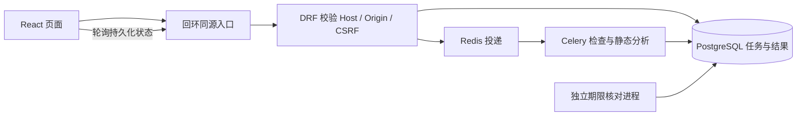

# 项目解读实验室

本地单用户学习工作台。已提供导入快照、静态分析与关联、源码浏览、外发预览及确认、本地讲解适配、固定练习和请求校验实验。实验仅运行固定可信示例，不运行导入源码。模型配置仅保留请求地址、模型 ID 和 API key；按用户要求，应用不设模型预算或请求期限，费用及供应商限制由用户判断。独立人工内容审阅及当前策略的 DeepSeek/deepseek-flash 基础非流式兼容已通过，v0.1 在标准样例与参考环境范围内完成本地验收。M1–M5 的任务状态与验证证据以 [首阶段计划](docs/phase-1-plan.md) 为唯一来源；该兼容结论不自动推广至其他模型或容量场景。

[v0.2 第二阶段计划](docs/phase-2-plan.md)记录已完成的同栈规则扩展、人工候选决定、快照对比和静态影响范围，以及参考环境回归、增量升级、真实浏览器和资源观测。工作台现有 57 个操作（含用户追加的快照命名），均从实现导出契约；不重算旧分析，不将人工决定送入模型，不执行导入源码。有限合成样例和静态影响不能推广为任意项目识别率或运行时影响保证。

## v1.0 稳定作品

本轮完成开发、参考环境工程验收和试用材料，实际证据只见[第四阶段计划](docs/phase-4-plan.md)，真实用户试用仍待执行。新增页面渲染异常恢复；既有 56 项 API、依赖、模型配置和历史协议保留。

统一独立演示入口为 `scripts/check_v1_release.py start --build`、`check`、`stop`，只管理随机项目与回环 5181，不读取根 `.env`，默认关闭模型。完整命令、前置工具和清理行为见[v1.0 演示](docs/v1-demo.md)；该文档同时说明架构、算法、失败案例和资源测量口径。[试用协议](docs/v1-trial.md)提供两项近似难度任务和空白观察表，不代表已有真人参与。

## 参考图工作台与浅色／深色模式

UI 专项采用紧凑面板、青绿色强调色及本地 SVG。首次深色，顶栏可切换并记住浅色/深色；搜索仅筛选当前快照文件。源码阅读是独立页面，文件树点击打开主源码，可用固定按钮打开第二窗口；窗口宽度至少 1200px 时并排阅读双源码，更窄窗口使用主/固定页签及项目结构抽屉。双窗口独立分段，刷新及前进/后退保留 URL 位置。

侧栏的工作台、项目导入、源码阅读、API 分析、静态关系图、快照与对比、候选影响、知识与学习、练习与实验、模型讲解、系统与任务各有独立页面。工作台只显示项目准备状态与下一步入口；API 分析展示接口定义和来源，关系图展示节点与连接，候选影响负责依据路径和人工决定。知识页只包含卡片和先修路径，固定题、作答回顾和受控实验在练习页。项目与快照信息共享，缺少资源时各模块显示自己的引导。

基础检查来自已加载的显式历史结果与检查时间，不是实时监控；系统任务列表在模块未激活时停止查询与轮询。模型请求继续先审阅完整外发范围并单次确认。主题和功能切换保留当前对象的未提交表单，不自动提交任务；切换项目、快照或接口时按资源归属隔离。旧作答、课程与实验链接仍按所属功能恢复。

按用户浏览器注释，已移除侧栏宣传和全局项目横幅，下拉框缩为区域宽度的 20%。在项目导入或快照页点击“命名当前快照”可显式保存服务端名称，刷新后仍显示；未命名时显示真实日期，不展示短编号。时间线分行显示名称、日期、文件数。关系页直接展示画布，每条返回关系均可选择，在图内查看节点或关系依据；范围、版本和截断提示同样在画布内。新增 `projects/0002_snapshot_name` 仅保存名称元数据，源码和分析引用保持原快照；当前工作台为 57 项 API，验证唯一见[浏览器注释调整](docs/phase-4-plan.md#browser-comments)。

[11 个模块设计预览](docs/previews/module-pages/index.html)以 `test/task-board.zip` 的教学源码为内容依据。图片是生成的设计预览，不是实际页面截图或运行验收证据。实际 API 页面只展示现有分析结果提供的方法、路径、处理对象与来源；请求字段和响应规则通过源码核对，不将预览文案扩展为新接口能力。本次页面拆分不增加模型调用方式或任意代码、地址与命令运行能力。

范围及验收标准见[总体路线图](docs/roadmap.md#ui-redesign)和[FR-21](docs/requirements.md#fr-21)，M21 的唯一进度与实际验证见[第四阶段计划](docs/phase-4-plan.md#ui-redesign)。本次独立 5181 验证不更新已有 5177 日常实例；真实用户试用仍待进行。

## 用户视角迭代与本地版本管理

工作台按当前状态给出“创建或打开项目 → 导入源码 ZIP → 选择根路由并分析”的下一步，加载和失效状态单独显示。没有快照时不显示空文件统计；已有快照使用真实名称与文件数。点击顶栏品牌返回工作台会保留当前项目、快照和未提交表单。

ZIP 前端上限与默认后端统一为 20 MiB，选文件后立即提示扩展名、空文件或超限问题。可查看文件名与字节数、移除重选；未知提交的恢复信息继续保留，移除文件不代表撤销服务端任务。窄屏功能导航使用模态菜单，Tab/Shift+Tab 在菜单内循环，Escape、遮罩或关闭按钮均可关闭并返回焦点。

项目已按用户授权建立本地 `main` 仓库，既有文档、后端、前端及验证材料分为四个基线提交，后续改进按功能提交。`.env`、`.runtime`、`.idea`、依赖与构建产物保持忽略；没有配置远程或推送。需求见 [FR-22](docs/requirements.md#fr-22)，本轮提交、检查结果、实际浏览器证据和环境恢复只记录在 [M22](docs/phase-4-plan.md#user-review)，后续优先级见[路线图](docs/roadmap.md#user-review)。

## v0.3 学习增强

[第三阶段计划](docs/phase-3-plan.md)维护本版规划、任务及实际证据。当前在“知识与学习”阅读卡片，选中任务簿创建接口后可选择已发布课程/目标，按先修闭包查看路径；在“练习与实验”的固定练习中作答。回顾作答时追加自评与笔记；“重新练习这道题”创建新记录，原答案和提示标记保留。自评已理解不代表系统判定掌握。

“实验”增加固定网络与进程两项实验，必须先填两个预测。网络展示 Worker 内 localhost 与服务名的真实 DNS/TCP；进程展示 PID、stdout、返回码、超时和 wait 回收。只运行固定可信程序，不运行导入源码、不接受任意地址或命令、不调用模型。服务名实验需要 Worker 与内置服务共用隔离网络；默认工作台未启动该服务时明确不可用。

原实例未更新。启用已有实例新代码时使用下节构建启动命令并保留命名卷；新增 learning/0002、labs/0002 为增量迁移，发布课程与新增知识卡片，不改写旧分析/作答/实验。验证完整系统实验可用独立 5180 实例（先确认端口空闲）：

```powershell
docker build -f infra/docker/backend.Dockerfile -t learning-lab-backend:v03-verify .
docker build -f infra/docker/frontend.Dockerfile -t learning-lab-frontend:v03-verify .
docker build -f infra/docker/task-board-backend.Dockerfile -t learning-lab-task-board-backend:m5-verify examples/task-board/backend
docker compose -p learning-lab-v03-verify -f compose.yaml -f infra/docker/compose.m5-verify.yaml -f infra/docker/compose.v03-verify.yaml --profile task-board up -d --no-build --wait --wait-timeout 90 api worker reconciler frontend task-board-api lab-reconciler
```

访问 [v0.3 独立工作台](http://127.0.0.1:5180/)。上述项目使用独立命名卷和网络，只发布回环工作台；不修改 5173/5174 日常实例。停止时用同一 `-p` 和三个 `-f` 参数执行 `stop`，保留数据卷。

开发回归可使用已有固定镜像依赖和只读源码挂载：根目录 `python -B -X utf8 scripts/check_v03_backend.py --labs -- python -B -m pytest apps common tests --ds=config.settings.local -q -p no:cacheprovider --tb=short`。升级脚本只接受独立空库：`python -B -X utf8 scripts/check_v03_backend.py -- env VERIFY_V03_UPGRADE=isolated-empty-database python -B /workspace/scripts/check_v03_upgrade.py`。HTTP 主线用 `check_v03_workspace.py --origin http://127.0.0.1:5180 --evidence .runtime/v03-http.json`，会新增验收项目及记录。源码验收的 `check_v03_stack.py start/stop` 仅管理自身标签资源，不能与上述 Compose 实例同时占用 5180。

## v0.2 分析增强

新分析支持标准 DRF Router 的字面量 `@action` 和常量模板 URL。选中已有候选请求后，可确认、排除或撤销，并查看修订历史；重新分析不会继承旧决定。

在“快照对比”显式选择基准和目标快照，同时选择各自分析后可比较接口及关系；只选快照时比较文件。打开变更文件查看双侧源码和行差异，再展开影响结果核对路径。未决候选默认不参与，启用后单独标记；旧讲解仍打开原快照，文件未变不代表讲解语义已验证。

已有运行实例没有在本次开发中更新。启用新代码时，使用下节原有构建启动命令并保留命名卷；migrate 应用 analysis/0004、0005 两项增量迁移，不自动重算历史。

## 启动与访问

工作目录：`F:\Program\Fall_Campus_Recruitment`。需要可用的 Docker Desktop Linux 引擎和 Compose；不需要安装全局 Python/Node 依赖。当前验证平台为 Windows x64 宿主与 Linux amd64 容器。

若 Docker CLI 未加入当前 PowerShell 的 PATH，仅对当前进程设置：

```powershell
$env:PATH = 'C:/Program Files/Docker/Docker/resources/bin;' + $env:PATH
docker compose up -d --build --wait --wait-timeout 90
```

访问 [本地工作台](http://127.0.0.1:5173/)，创建项目并导入 ZIP；“系统与任务”中保留“开始基础检查”。入口固定为 `127.0.0.1:5173`，端口被占用时启动失败，不自动换端口或接受其他来源。Docker 镜像首次构建需要访问官方包源；固定镜像摘要、Python 锁文件和 npm 锁文件用于复现，不共享宿主依赖目录。

初始化服务只在本项目私有命名卷生成数据库与 Django 凭据；不会输出或写入源码。不要手动复制真实凭据到 `.env.example`。后端配置入口支持进程环境及 `*_FILE`，拒绝占位值；Compose 使用自身固定配置，无需创建 `.env`。数据库、Redis、API、Worker 和核对进程只加入内部网络，只有 Nginx 发布宿主回环端口。

点击检查后，任务先写入 PostgreSQL，再经 Redis 交给 Celery Worker。结果与成功状态在同一数据库事务中提交。刷新浏览器或重启服务后记录仍保留。失败任务显示原因；未知提交使用原操作标识恢复，不自动重投。



## 独立任务管理示例

从根目录执行 `docker compose up -d --build --wait --wait-timeout 90 task-board-frontend`，访问 [任务簿](http://127.0.0.1:5174/)。示例使用独立数据库、网络、凭据卷和前后端依赖，不依赖工作台 API/Worker。正常标题保存后更新列表；缺失、空及纯空白标题拒绝且不写入。同键重复提交只返回原记录。详细运行、源码关系和检查命令见[示例说明](examples/task-board/README.md)。普通工作台启动不会自动启动示例；当前仅为后续分析、学习与实验准备基准。

## 页面试用用测试项目

`test/` 提供任务簿核心源码目录及可直接导入的 [task-board.zip](test/task-board.zip)。ZIP 内含 9 个 DRF + React 源码文件，保持已发布示例的路径与摘要；分析时根路由填写 `backend/config/urls.py`，可选择 `POST /api/v1/tasks/` 试用源码、关系及学习页面。操作步骤和范围见 [test/README.md](test/README.md)，交付验证唯一记录在[第四阶段计划](docs/phase-4-plan.md#trial-test-project)。

该包是只读导入材料；完整可运行应用仍由 `examples/task-board` 维护，导入不会执行源码或启动服务。

## 检查与故障定位

根目录运行真实 HTTP 检查，令牌仅保留在内存中，输出不包含凭据：

```powershell
python -X utf8 scripts/check_local_stack.py
docker compose ps
```

`check_local_stack.py` 验证匿名 CSRF/来源拒绝、非回环拒绝、提交、幂等和结果读取，会创建真实无业务内容的检查记录。查看历史中的失败原因；排队或执行超过默认 300 秒后，独立核对进程在下一个 5 秒周期终结任务。数据库不可用时核对暂不可执行，恢复连接后继续；若核对进程本身退出，需恢复该服务。

故障测试会短暂停止**本项目** Redis、Worker 和 PostgreSQL，并重启整组服务；不删除数据卷。仅在可以短暂中断工作台时执行：

```powershell
docker compose -f compose.yaml -f infra/docker/compose.verify.yaml up -d --wait --wait-timeout 90
python -X utf8 scripts/check_local_stack.py --faults
docker compose up -d --wait --wait-timeout 90
```

验收覆盖配置将任务期限缩短为 10 秒；最后一条命令恢复正常的 300 秒。脚本在故障退出路径恢复所停止的依赖，报告保存在被忽略的 `.runtime/m1-t02-http-verification.json`。不会自动清理检查历史。停止本项目服务使用 `docker compose stop`；命名卷保持不动，不使用会删除数据的清理选项。

## M3 工作区与独立验收

创建项目后展开“导入新快照”，上传不超过 20 MiB 的 ZIP。导入成功后打开结果，显式选择根路由；教学示例为 `backend/config/urls.py`。提交分析后打开任务结果，选择 `POST /api/v1/tasks/`，依次核对 handleSubmit、mutationFn、createTask、请求、接口、TaskSerializer 与 Task。每条边区分源码包含、直接调用、框架分派与方法/路径关联；这些都是静态证据，不代表实际执行。

来源通过快照文件清单定位，源码只读且分段读取。项目、快照、分析、接口、节点和来源保存在 URL；刷新及前进后退可恢复。分析历史从筛选后的任务记录读取，失败任务可以显式重试；导入重试要重新选择原 ZIP。未知提交保留操作键和摘要，同输入恢复，不自动重发。浏览器不保存归档或源码正文。

解析器仅使用传入文本和可信 TypeScript 6.0.3，不加载导入项目配置、插件或依赖。未知基础路径、动态 URL、重复候选和不支持的规则保留诊断。旧记录的 frontend=null 表示未分析前端，读取不会回填；需要新结果时明确提交一次新分析。

独立验收入口使用 `127.0.0.1:5175`、独立数据卷和网络，不改变 5173/5174 的日常实例。以下命令均在根目录执行；需要已安装并构建独立解析工程，或先运行镜像构建（镜像包含可信解析器）：

```powershell
docker build -f infra/docker/backend.Dockerfile -t learning-lab-backend:m3-verify .
docker build -f infra/docker/frontend.Dockerfile -t learning-lab-frontend:m3-verify .
docker compose -p learning-lab-m3-verify -f compose.yaml -f infra/docker/compose.m3-verify.yaml up -d --no-build --wait --wait-timeout 90 api worker reconciler frontend
& '.runtime/m1-t02-venv/Scripts/python.exe' -B -X utf8 scripts/check_m3_workspace.py
```

脚本只连接 5175，会创建测试项目、合成快照和分析，并验证幂等、候选、单文件语法失败、接口范围与模型来源；不会执行归档源码。摘要位于被忽略的 `.runtime/m3-http-verification.json`。源码挂载方式运行上述 pytest 时，先在 `analyzers/typescript` 用固定 Node/npm 执行 `npm ci --ignore-scripts`、`npm run typecheck`、`npm test`、`npm run build`；不共享前端 node_modules。停止验收实例可执行 `docker compose -p learning-lab-m3-verify -f compose.yaml -f infra/docker/compose.m3-verify.yaml stop`，保留数据卷。

## 开发验证入口

后端聚焦测试使用独立 M3 实例的真实 PostgreSQL；先按上节准备解析器和验收服务，再在根目录执行：

```powershell
docker compose -p learning-lab-m3-verify -f compose.yaml -f infra/docker/compose.m3-verify.yaml run --rm --no-deps -e APP_PORT=5173 -e APP_ORIGIN=http://127.0.0.1:5173 -e PYTHONPYCACHEPREFIX=/tmp/m3-pycache -v F:/Program/Fall_Campus_Recruitment/backend:/workspace/backend:ro -v F:/Program/Fall_Campus_Recruitment/contracts:/workspace/contracts:ro -v F:/Program/Fall_Campus_Recruitment/analyzers:/workspace/analyzers:ro -v F:/Program/Fall_Campus_Recruitment/examples:/workspace/examples:ro -v F:/Program/Fall_Campus_Recruitment/testdata:/workspace/testdata:ro -w /workspace/backend api python -B -m pytest apps tests --ds=config.settings.local -q -p no:cacheprovider --tb=short
docker compose -p learning-lab-m3-verify -f compose.yaml -f infra/docker/compose.m3-verify.yaml run --rm --no-deps api python manage.py check
```

本地质量工具仍使用 M1-T01 的隔离版本。后端在 `backend` 执行 `ruff check .`、`ruff format --check .`、`mypy config common apps tests --platform linux --no-incremental`；对应 uv/Python 环境必须已按 `uv.lock` 安装，不能用未完成的旧 `.venv`。前端在 `frontend` 使用 Node 24.21.0/npm 11.19.0 执行 `npm run typecheck`、`npm run lint`、`npm run format:check`、`npm run test -- --run`、`npm run test:tooling`、`npm run build`。

本任务接口的契约更新顺序：在 `backend` 执行 `python manage.py spectacular --settings config.settings.test --file ../contracts/openapi.yaml --validate --fail-on-warn`；再在 `frontend` 执行 `npm run api:types`。该入口只读取本地 Schema，不调用远端生成服务。生成文件为 `frontend/src/shared/api/generated/schema.d.ts`，禁止手改。工作台导出 56 个操作，独立示例公开契约为 3 个操作；实验专用配置另导出 7 个操作（包含原 3 个），不供工作台浏览器直接调用。核对表见 [API 清单](docs/api-catalog.md)。

契约检查不需要启动服务。使用已经安装两套后端依赖的固定 Python，以及两套已安装的前端依赖；以下命令只在 `.runtime` 暂存导出，不覆盖 Schema/类型，不安装工具、不读取实际秘密：

```powershell
& '.runtime/m1-t02-venv/Scripts/python.exe' -X utf8 scripts/check_contracts.py --node .runtime/tools/node-v24.21.0-win-x64/node.exe
& '.runtime/m1-t02-venv/Scripts/python.exe' -X utf8 -m unittest discover -s scripts -p test_check*.py -v
```

`m1-t02-venv` 是本地已有的已锁定依赖环境；其他参考环境使用按对应 `uv.lock` 安装的 Python，`--node` 指定固定 Node。总检查依次核对实现导出、保存的 Schema、已实现接口表、无数据库契约用例、生成类型和 TypeScript。失败后先审阅设计与实现，再从各自后端导出、各自前端运行 `npm run api:types`，最后复查。单独检查类型使用 `npm run api:types:check`；两端 `npm run test:tooling` 包含“缺失/人为漂移必须失败且不覆盖”的回归测试。

后端涉及持久化的契约测试仍使用前述 PostgreSQL 测试命令；总检查不代替数据库、队列或完整产品验收。现有容器从镜像读取源码，在未重建时仍运行旧版本；M3 使用独立镜像、Compose 项目及只读源码挂载测试，不重启日常工作台或示例。

## 项目导入与快照 API

v0.2 的独立后端和历史升级验证入口见 `scripts/check_v02_backend.py`、`scripts/check_v02_upgrade.py`；可重放的回环 HTTP 主线见 `scripts/check_v02_workspace.py --help`。精确命令、隔离条件和实测结果集中记录在[第二阶段计划](docs/phase-2-plan.md)，这些脚本不替代真实模型验收或容量测试。

M2-T01 的 API 及字段见 [API 清单 4.8](docs/api-catalog.md)。先用 `POST /api/v1/projects/` 创建项目，再用 `POST /api/v1/projects/{project_id}/imports/` 上传单个 `archive` 文件；两者都需获取 `/csrf/` 后携带 Cookie、X-CSRFToken、精确 Origin 和 UUID Idempotency-Key。导入接收返回任务 Location，成功后的 result_url 指向新快照；同键同一 ZIP 恢复原任务，新键重新导入生成独立快照。

工作区提供项目创建和 ZIP 上传表单。读取快照文件清单后，用文件标识及 start_line/end_line 调用 content API，不能提交宿主路径。摘要只保留过滤计数和稳定原因，不保存排除文件内容；每次导入独立，失败不替换旧快照。现有任务页面可以显示导入历史和快照标识。

运行存储仅支持 Linux，源码保存在私有 `import-data` 命名卷；首次正常启动时 `initialize-imports` 设置该卷权限，随后 migrate 应用新增迁移。此次开发没有更新正在运行的旧镜像或现有数据库；需要使用新接口时，在根目录执行上文 `docker compose up -d --build --wait --wait-timeout 90`，会重建并重启本地服务，不删除历史卷。不要使用 `down -v` 清理快照。

本任务的可重复后端验收（服务已更新并启动后）为：

```powershell
docker compose -p learning-lab-m3-verify -f compose.yaml -f infra/docker/compose.m3-verify.yaml run --rm --no-deps -e APP_PORT=5173 -e APP_ORIGIN=http://127.0.0.1:5173 -e PYTHONPYCACHEPREFIX=/tmp/m3-pycache -v F:/Program/Fall_Campus_Recruitment/backend:/workspace/backend:ro -v F:/Program/Fall_Campus_Recruitment/contracts:/workspace/contracts:ro -v F:/Program/Fall_Campus_Recruitment/analyzers:/workspace/analyzers:ro -v F:/Program/Fall_Campus_Recruitment/examples:/workspace/examples:ro -v F:/Program/Fall_Campus_Recruitment/testdata:/workspace/testdata:ro -w /workspace/backend api python -B -m pytest apps tests --ds=config.settings.local -q -p no:cacheprovider --tb=short
```

命令使用已有镜像依赖，只读挂载当前后端与教学样例源码，避免误测旧镜像代码。用例使用临时测试库、临时存储和唯一 Redis 队列，覆盖真实进程退出及真实队列；不执行 ZIP 中的源码，不发送外部请求。恢复扫描与既有 `reconcile_jobs` 同进程执行；磁盘或数据库暂不可用时保留失败诊断，恢复后再次核对。

## 后端静态分析 API

M2-T02 的四个操作见 [API 清单 4.9](docs/api-catalog.md)。取得快照后向 `POST /api/v1/snapshots/{snapshot_id}/analyses/` 提交 `{"root_urlconf":"backend/config/urls.py"}`，文件路径必须来自该快照清单。沿用 CSRF/Origin/UUID 操作键；根路由明确选择，服务端不猜入口。成功任务的 result_url 可读规则版本、覆盖摘要，再访问其 `endpoints/` 和 `diagnostics/`。同键恢复原请求，新键创建独立结果。

结果展示源码事实、静态推断和框架依据。Router 隐式 create 等动作没有用户方法行号；可核对注册位置与规则标识。动态选择、缺失引用及语法错误都保留诊断，任务成功不等于完整识别。没有调用模型、安装导入依赖或执行导入源码。工作区可显式提交分析、恢复历史、浏览接口及源码；右侧展示证据和诊断。

后端 analysis 迁移在临时测试库和独立 M3 验收库验证；日常业务镜像/库未更新。如需启用新接口，按上文正常启动命令重建本地服务，不删除卷。聚焦验证在根目录执行：

```powershell
docker compose -p learning-lab-m3-verify -f compose.yaml -f infra/docker/compose.m3-verify.yaml run --rm --no-deps -e APP_PORT=5173 -e APP_ORIGIN=http://127.0.0.1:5173 -e PYTHONPYCACHEPREFIX=/tmp/m3-pycache -v F:/Program/Fall_Campus_Recruitment/backend:/workspace/backend:ro -v F:/Program/Fall_Campus_Recruitment/contracts:/workspace/contracts:ro -v F:/Program/Fall_Campus_Recruitment/analyzers:/workspace/analyzers:ro -v F:/Program/Fall_Campus_Recruitment/examples:/workspace/examples:ro -v F:/Program/Fall_Campus_Recruitment/testdata:/workspace/testdata:ro -w /workspace/backend api python -B -m pytest apps/analysis/tests --ds=config.settings.local -q -p no:cacheprovider --tb=short
```

解析进程仅支持 Linux，默认 60 秒、768 MiB 地址空间及 8 MiB 输出预算；详细规则和限制见[后端规范](docs/backend-guidelines.md)。这不是容量或任意第三方运行兼容性承诺。

## 静态关系图 API

新分析成功后可读取 `GET /api/v1/analyses/{analysis_id}/graph/`。接口返回节点、边、证据、版本、覆盖说明及诊断链接；查询参数与截断语义见 [API 清单 4.10](docs/api-catalog.md)。先读取图，找到所需 method/path 的 endpoint 节点，再用其 id 作为 `root_node_id`，可选择 `algorithm=bfs` 或 `dfs`。该 ID 只属于原分析，不能用于另一快照或分析。

图 v2 包含前端函数、请求、接口、视图、序列化器和模型关系；使用 `endpoint_index` 可同时查看指定接口的前端上游与后端下游，与 `root_node_id` 互斥。框架动作保留规则依据而不伪造方法行号；未知关联保持断点，重复候选不会合并为唯一处理器。图的可达性不是运行轨迹。查询截断由 `truncated` 和 `truncation_reasons` 明示；`coverage.complete` 继续描述解析覆盖，不代替截断标记。

旧分析没有图时返回 `409 GRAPH_NOT_AVAILABLE`，已有结果和快照仍可读取。对同一快照使用新 UUID 操作键重新提交原分析请求才能得到新图；旧键只恢复旧任务。GET 不生成或回填图。工作区已提供接口视角、关系步骤和来源联动；图 v1 历史仍可读取。

新增图迁移和 API/Worker 已在临时测试库验证，现有业务镜像及数据库未更新。需要启用时按上文正常启动命令重建本地服务并运行迁移；不删除命名卷。聚焦测试沿用上一节 Docker 命令，`apps/analysis/tests` 包含图算法、API、原子发布与历史迁移验收。

## 失败任务的显式重试与恢复

向 `POST /api/v1/jobs/{job_id}/retries/` 提交新 UUID Idempotency-Key，并携带原有 CSRF/Origin 保护。仅允许失败任务：基础检查和分析使用空 JSON 对象；分析保持原快照和 root_urlconf。导入必须重新上传与原 ZIP 字节相同的 archive 文件，因为失败暂存会被清理；不同内容返回 409，不会偷偷替换输入。详细字段和错误见 [API 清单 4.11](docs/api-catalog.md)。

新任务保存 previous_job_id，旧任务和错误继续可读；历史页面展示“重试自任务”。相同重试键恢复同一任务，不重新投递；新尝试再次失败时，针对它再用新键重试。首次返回 202，同键返回 200；投递未确认返回 503 和任务 Location，应先查询，不能自动换键重发。工作区提供导入、分析及失败任务的显式重试表单；导入重试仍要求重新选择原 ZIP。

PostgreSQL 保存执行资格与期限，Redis 仅传递任务 ID。任务入库后、投递前退出由排队期限核对收敛；Worker 退出由执行期限核对收敛。核对进程启动立即扫描，此后每 5 秒执行，默认排队/执行各 300 秒。模型请求等待期间持续续期领取，不受固定总执行期限限制；Worker 停止续期后仍由核对收敛。数据库或核对进程不可用时不能承诺这一时间内收敛，恢复后继续扫描。终态和过期领取拒绝迟到写入，不自动重试任务。

新增 jobs/0003 迁移只增加可空的原任务关联，不改写旧记录。本次在临时测试库验证，未迁移现有业务库或重启现有服务；启用新版本仍使用本文开头的正常构建启动命令。不要只更新后端而继续使用拒绝非空 previous_job_id 的旧前端。

M2-T04 后端验证可沿用上一节 Docker 命令，将测试路径改为 `apps/jobs/tests apps/projects/tests apps/analysis/tests tests`。故障用例仅使用临时测试库、独立队列与临时存储，主动结束测试进程；不停止已有服务。前端在 frontend 使用固定 Node 执行 `node node_modules/vitest/vitest.mjs run src/features/jobs`，覆盖关联校验及重新挂载后的历史恢复。

## 边界与文档

本地 HTTP 的 host-only、SameSite=Strict Cookie 和匿名 CSRF/Origin 防护不能替代公网身份认证。当前只允许可信单用户本机访问，不防御同一操作系统的恶意进程；未经独立安全设计不能扩大网络绑定范围。固定检查不接收命令或源码，也不代表分析、模型或示例实验成功。

基础镜像包含本地质量验证工具；未做公开发布、生产容量或 ARM 平台验收。导入资源限制与模型外发确认保留，模型请求不设应用预算。此前真实调用与失败均保留历史，本次策略变更未追加真实调用。参见 [需求](docs/requirements.md)、[API 清单](docs/api-catalog.md)、[API 规范](docs/api-conventions.md)、[结构](docs/project-structure.md)、[前端规范](docs/frontend-guidelines.md)、[后端规范](docs/backend-guidelines.md) 和 [路线图](docs/roadmap.md)。

## 讲解与固定练习（M4）

M4 建立了讲解与固定练习，当前分别通过“模型讲解”和“练习与实验”独立页面访问；源码引用进入“源码阅读”，不在这些页面重复挂载源码工作区。讲解先生成不可变预览，可逐项审阅模板、完整消息、片段、目标、实际字节数及遗漏，取消节点或排除片段后重新预览。勾选接受并「保存本次确认」只保存确认记录；「提交本次讲解」才创建任务。拒绝不创建任务。失败重试必须重新确认原预览并使用新操作键，可能重复计费。模型配置变化后需要新预览；旧讲解仍可读取。结果为纯文本，引用位置核验不等于结论正确。

固定练习仅适用于 `task-board/1.0.0` 相关源码摘要匹配的 POST `/api/v1/tasks/`。其他项目显示无对应练习。5 张知识卡片与 3 类题目由 `content/knowledge/`、`content/exercises/` 维护；内容中的维护说明保留原来源，用户已于2026-09-30独立审阅当前版本，结论见阶段计划。题目接口不含答案，提交后才返回固定反馈；正确、错误与提示使用均保留历史，不产生掌握度评分。

教学内容只进入后端镜像，迁移服务显式执行 `python manage.py load_learning_content`。手动重复执行该命令是幂等的；同一版本内容变化会拒绝并回滚，修改题干/答案/示例摘要必须发布相应新版本，旧作答保留。运行时不会读取导入项目中的教学配置，也不会执行导入源码。

模型地址和 ID 默认空值，静态浏览、练习和历史不依赖模型。模型用户配置仅有 `MODEL_BASE_URL`（HTTPS、无凭据/查询串/片段）、`MODEL_NAME` 和 `MODEL_API_KEY`；不再使用开关或限额配置。独立密钥文件方式仍可通过 `MODEL_API_KEY_FILE` 和 `infra/docker/compose.model.yaml` 使用同一凭据，不增加模型行为设置。API 仅接收非秘密配置，只有 Worker 加入模型出口网络。不要把凭据发到会话、日志或共享工程文件。配置成功不代表供应商兼容验收通过。

需要在根目录 `.env` 填写配置时，仅填写 `MODEL_BASE_URL`、`MODEL_NAME`、`MODEL_API_KEY`（保留单引号），并显式使用 `infra/docker/compose.model-env.yaml`，不要同时叠加密钥文件配置或固定替身配置。地址为 HTTPS API 基础地址，程序追加 `/chat/completions`；模型 ID 按供应商填写。`.env` 已被 Git 和镜像构建排除，不提交、不输出其内容；这是本机凭据文件，不是共享工程配置。当前 Windows Compose 的环境源 secret 创建受限，因此此方式仅通过 Worker 环境变量注入密钥，API/前端不接收密钥；需要文件挂载时仍使用 `compose.model.yaml`。密钥会存在于 Worker 容器配置中，不要输出完整的 `docker compose config`、`config --environment` 或容器环境。

用户填完后，人工审阅实例可沿用 M5 的5177及原数据卷，在根目录执行：

```powershell
docker compose --env-file .env -p learning-lab-m5-verify -f compose.yaml -f infra/docker/compose.m5-verify.yaml -f infra/docker/compose.model-env.yaml --profile task-board up -d --no-build --pull never --wait --wait-timeout 120 frontend worker reconciler task-board-api lab-reconciler
```

启动不自动调用模型；页面仍须重新准备预览、审阅目标与源码范围、确认并提交。请求只发送 model、messages 和 stream=false，不发送 max_tokens 或 max_completion_tokens；应用不设输入/原始响应字节预算、输出 token 上限或请求总期限。供应商默认限额、网络/系统条件仍可能终止请求，实际费用由供应商决定。长时间等待会占用当前唯一 Worker 执行槽位。只有明确的人工审阅及真实兼容结果才能更新验收状态。

结果分别显示供应商报告的输入、输出和总用量，不按输出用量拒绝有效讲解；缺少 usage 时显示未知，不估算金额。拒答、截断、非法结构和无效引用仍失败，不自动重发。历史预算预览可读但不能再次确认或提交，需准备新预览；旧结果和原预算测试失败记录原样保留。当前策略的真实兼容结论已记录，每次追加真实调用仍须重新审阅并取得单次确认；详细结果只见[首阶段计划](docs/phase-1-plan.md)，本轮未追加调用。

独立本地验收（项目根目录；保留 5173/5174/5175）：

```powershell
docker compose -p learning-lab-m4-verify -f compose.yaml -f infra/docker/compose.m4-verify.yaml up -d --build
python -X utf8 scripts/check_m4_workspace.py
```

以上模型关闭。固定替身验收需显式追加 `-f infra/docker/compose.m4-double.yaml` 后运行相同 `up` 命令，再执行 `python -X utf8 scripts/check_m4_workspace.py --model-double`。替身仅允许独立 5176/5177 和 `m4-test-double`，没有凭据、外网出口或计费行为，不能作为真实供应商验收证据。脚本只导入内置相关源码，创建无敏感验收记录；端口冲突失败，不自动换端口。`--verify-history` 只读取上一轮本地验收记录，可在该独立实例重启后执行。测试数据卷不自动删除。

## 请求校验实验与本地演示（M5）

项目根目录执行以下命令，使用独立项目、空数据卷首次初始化及 5177 回环入口。已有 5173–5176 实例不受影响。需要已安装的 Docker Desktop/Linux 容器；参考环境使用已有固定工具及镜像缓存，未验证全新宿主下载过程。PowerShell 中 Docker 未加入 PATH 时，把 `docker` 替换为 `& 'C:/Program Files/Docker/Docker/resources/bin/docker.exe'`。Python 使用项目 `.runtime/m1-t02-venv/Scripts/python.exe` 或按既有锁文件准备的同版环境。

```powershell
docker compose -p learning-lab-m5-verify -f compose.yaml -f infra/docker/compose.m5-verify.yaml --profile task-board build api frontend task-board-api
docker compose -p learning-lab-m5-verify -f compose.yaml -f infra/docker/compose.m5-verify.yaml --profile task-board up -d --no-build --wait frontend worker reconciler task-board-api lab-reconciler
python -X utf8 scripts/check_m5_workspace.py
```

不要省略服务列表：该验收配置只通过 Worker 访问内部实验 API，无需启动 `task-board-frontend` 或占用 5174。默认不启用模型；如需复现完整本地讲解流程，显式给上述 `up` 命令再追加 `-f infra/docker/compose.m4-double.yaml`（放在 `--profile` 前），然后执行 `python -X utf8 scripts/check_m5_workspace.py --model-double`。该流程的讲解来自固定替身，用量为空、无真实调用费用。恢复默认配置时重新执行未叠加替身的 `up` 命令。

演示顺序：打开脚本输出的 [5177 工作区](http://127.0.0.1:5177/)，查看创建任务接口的流程与源码；在讲解面板预览、确认并提交本地替身；在练习面板作答查看固定反馈；在实验面板分别填写四种标题的 HTTP 状态与新增记录预测，再提交。正常标题应实际返回 201、写入 1 条，其余返回 400、写入 0 条；展开“实际响应”核对正文，刷新仍能读取预测及观测。预测即使错误也原样保留。来源显示 `task-board/1.0.0+request-validation/1`，学习快照只用于定位适用性。

故障与恢复：实验未启动会产生失败记录；响应不完整保留已知响应与空缺计数；清理未确认不能视为成功。服务恢复后点击任务显式重试，保留原尝试并建立新运行。每次运行只清理自己的四个固定操作键对应数据，关闭记录阻止迟到写入；运行 120 秒到期后独立 `lab-reconciler` 每 5 秒核对，数据库/进程恢复前不承诺准时清理。历史“清理未确认”不因稍后后台回收而被静默改写。大量长期关闭标记的归档不在首版范围。

验证脚本的 `--labs-only` 复用已导入上下文，`--expect-failure` 验证人工停止本独立项目的 `task-board-api` 后的失败，`--verify-history` 只读核对上一轮记录。故障验证后必须恢复该服务；不要对日常项目执行停服。重启验证可执行同一配置的 `restart postgres redis task-board-postgres api worker reconciler task-board-api lab-reconciler frontend`，等待健康状态后运行 `--verify-history`。不删除数据卷。

迁移仅新增工作台 `labs/0001` 与实验专用示例 `labs/0001`，默认示例配置不加载实验 app。实验内部 Schema 在示例 backend 用 `python manage.py spectacular --settings config.settings.labs_test --file ../contracts/labs-openapi.yaml --validate --fail-on-warn` 生成。根 `scripts/check_contracts.py --node <固定 Node 路径>` 检查三份 Schema、接口表及两套前端类型；实际测试命令、验收矩阵、资源数字和剩余限制见阶段计划的 M5 记录。
