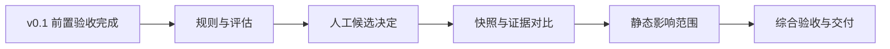

# 项目解读实验室：v0.2 开发计划

| 项目 | 内容 |
| --- | --- |
| 文档版本 | v0.5 |
| 文档状态 | 四项分析增强已实现，参考环境验收通过；交付证据及限制见第 6 节 |
| 更新日期 | 2026-10-01 |
| 适用阶段 | 产品 v0.2 的 M6 至 M10 |
| 本文职责 | v0.2 的任务范围、执行依赖、唯一任务进度和验证记录 |

## 1. 当前状态与进入条件

用户已确认 v0.2 覆盖同栈规则扩展、人工确认候选、快照对比和静态影响范围，并明确要求先完成 v0.1 再开发本版。v0.1 本地验收及本版进入门槛已满足，证据与结论只见[首阶段计划](phase-1-plan.md)最新记录。此前“后续再进行测试，先把规划做完”已按第 6 节历史记录完成；当前用户目标为完成 v0.2 开发，并授权编码代理核对规则样例，要求保持功能正常和模块清楚，不增加无关设计。

以下任务表记录最终状态，直接行为、完整回归、增量升级、浏览器和资源证据见第 6 节。M6 样例为编码代理维护的合成开发/评估集；按用户本次授权完成编码复核，不冒称独立人工标注。M4 的独立人工审阅历史结论不受此调整影响。恢复时核对已有产物和测试记录，不覆盖或重复实现；不自动开始 v0.3。

v0.1 的状态与证据继续唯一维护在[首阶段计划](phase-1-plan.md)。进入 M6 前必须按原编号完成：

1. M4-T01：选定真实服务及模型，按当前三项模型配置、无应用预算或请求总期限策略，在可审阅发送内容和有效单次外发确认下完成兼容验收；供应商限制及费用由用户判断，密钥仅在本地受控配置中准备，不写入文档、命令或聊天。测试替身不能替代真实服务记录。
2. M4-T03：由实际独立人工审阅者核对五张知识卡片、三类固定题及其答案、解释、示例版本和源码依据，记录审阅范围、版本、结论及必要修正。编码代理再次检查不等于独立人工审阅。
3. 将上述证据及 v0.1 交付结论更新到首阶段计划；有未解决的关键问题时仍不得开始 M6。无需为补齐门槛无条件重跑所有已通过用例。

本版仍为本地单用户、DRF + React、导入源码只读分析。当前目录不是 Git 仓库，修改前使用非敏感文件副本和摘要核对已有内容，不自行初始化 Git。新任务只在有明确执行范围且前置条件满足时开始；文档入口或任务表本身不授权自动推进。

## 2. 目标与已确认边界

用户能够判断关系是否可信、两次源码导入之间发生了什么变化，以及哪些接口和前端入口可能受到影响。需求唯一来源为[FR-09 至 FR-12](requirements.md#v02-requirements)，版本边界见[路线图](roadmap.md#v02-scope)。

| 能力 | 本版承诺 | 保留边界 |
| --- | --- | --- |
| 规则扩展 | 标准 Router 的字面量 `@action`、完全由字符串常量组成的模板 URL | 不扩展通用调用图、参数化请求封装、环境配置求值或其他框架 |
| 人工关系 | 确认、排除、撤销当前分析的前端请求—后端接口候选 | 不补建任意关系；只用于关系展示和影响分析，不进入模型上下文 |
| 快照对比 | 文件增删改及行级差异、接口和可唯一对应的关系变化、证据适用性 | 不推断重命名或移动，不通过跨分析 UUID 对齐节点 |
| 影响范围 | 两侧变更起点、有界反向遍历、可追溯路径和覆盖说明 | 不声明精确运行时调用或“没有找到即没有影响” |

不引入增量缓存、图数据库、新框架、通用图编辑、新实验、学习路径、多用户或公网部署。不升级无关依赖，不改动教学示例的九个基准源码来适配新规则。

## 3. 实施设计与组件归属

### 3.1 规则及评估基线

M6-T01 先在现有 `testdata/analysis` 中维护分离的开发样例与评估样例，记录来源、样例版本、经复核的预期、复核角色、支持类别和反例。保留原 task-board 与 drf-static 基准，先保存旧规则运行结果，再实现扩展。新增最小样例须明确为合成样例，不称为真实用户项目评估。

- DRF：扩展现有 Python AST、规则和 Router 逻辑，识别字面量 `detail`、`methods`、`url_path` 及直接指定的 `serializer_class`；只有框架允许省略的参数才采用已锁定 DRF 的默认值，缺少必填参数或动态表达式保留诊断。证据同时保留装饰器、注册位置和框架规则依据。
- 前端：扩展现有 TypeScript Compiler API 的字符串求值，支持字符串字面量、不可变常量及其模板插值，沿用有界求值和绑定校验；运行时参数、可变值、遮蔽和未知基础地址不升级为自动确认。
- 报告分开发集和评估集给出正确识别、错误关联、漏识别、候选、不支持项及相应分母；零分母报告不适用，不伪造准确率。有限评估集中的错误自动确认逐项解决，旧基准不得回归。
- 规则版本独立升版，新操作生成新 Analysis；旧分析、图、确认及历史结果不回填。内部协议形状确需变化时再同步两端校验与协议版本。

### 3.2 人工决定

analysis 服务保存独立的追加记录，包含分析、请求、候选目标、动作、时间及修订号，不修改 Analysis/AnalysisGraph 的原始静态结果。每个请求最多确认一个目标；确认新目标替代当前确认，但不自动排除其他目标；排除当前确认的目标会解除该确认；撤销清除该候选的当前人工决定并保留历史。

同一请求按修订号和数据库事务串行处理变更，旧修订提交返回冲突，不静默覆盖。幂等重放恢复原记录，不重复追加。重新分析或更换快照后不自动迁移人工决定。

前端通过独立人工决定元数据展示自动静态匹配、人工确认、未决候选和人工排除；原有 `confirmed/candidate/unmatched` 字段仍表达原始静态结果。讲解保持原静态证据入口，不应用人工决定；界面明确其区别。

### 3.3 快照与接口对比

差异逻辑放在既有结构约定的 `backend/apps/analysis/diffs/`，通过 projects 服务读取已发布源码，不复制存储实现。用户显式选择同项目的基准快照和目标快照；接口对比需成对指定各自的分析，两项都不提供时仅比较文件。允许相同快照用于无变化验证；跨项目或错误归属拒绝，不自动选取“最新分析”。

按规范化路径和现有 SHA-256 判断新增、删除、修改、未变；标准库生成行级差异，重命名和移动按删除加新增呈现。LF 规范化在导入时已经完成，不将原归档换行形式当作源码语义变化。

接口按方法、完整路径和路径类型唯一匹配，再比较处理器、序列化器、模型及可唯一对应的关系；排除仅由行号偏移、快照 ID 或分析 UUID 变化形成的假差异。重复接口和模糊节点明确待判断。两侧分析入口或后端、前端、关联规则版本不一致时保留文件结果，接口/关系结果标为不可直接比较。

旧讲解和引用仍属于原快照。读取其已保存引用与预览片段，按目标快照标注“引用文件未变”“需要复核”“来源已删除”“无法判断”；同一讲解有多个引用时逐项展示，不用某个未变引用掩盖其他失效引用。任何状态都不自动认定讲解语义正确，不改写旧正文，不触发模型调用。

对比请求和结果归 analysis，jobs 管理新 `snapshot_comparison` 任务的四态、幂等、执行资格、期限和显式重试。Job.snapshot_id 绑定目标快照，业务请求另外持有基准及目标两侧标识；失败重试使用原绑定和新任务。差异计算受子进程期限及输入输出预算约束，超限明确失败；完整结果与成功状态原子发布，GET 不执行解析或回填。

### 3.4 静态影响范围

从指定节点或快照对比中的变更位置出发，根据节点引用和边的证据引用确定起点；基准侧处理删除及修改前位置，目标侧处理新增及修改后位置。无法定位到图的变更文件保留为覆盖缺口，不能从结果中丢弃。

沿依赖边反向遍历，输出相关接口、请求和前端入口，每项至少保留一条来自对应图的依据路径。人工排除优先于候选开关；人工确认及自动静态关系默认参与，未决候选默认排除，显式开启后标注哪些结果依赖候选。结果绑定所用人工决定修订，避免同次结果混用不同修订。

使用访问集合处理环，沿用已有图节点/边查询预算及截断说明，不递归枚举全部路径。基准与目标结果分别显示；无法比较、没有找到、覆盖不完整与预算截断分别表达。该能力不将静态可达性解释为运行轨迹。

### 3.5 前端、契约及迁移

复用 analysis feature 和现有源码组件，由 app 组合跨功能区域，延续 React、Ant Design、TanStack Query 和 History API。URL 保存对比对象、文件和候选选择；查询键包含相应项目、快照/分析、对比对象、文件及候选开关，人工修订随响应保存，决定修改后失效对应影响查询。切换后取消无用读取，迟到响应不得污染当前选择；未知提交继续使用原幂等键恢复。

HTTP 保持 `/api/v1/`。9 个新增操作的路径、编号、任务与 operation_id 见 [API 登记清单](api-catalog.md#v02-api-plan)，公共语义见 [v0.2 契约约定](api-conventions.md#v02-contract)。只在对应实现完成后导出 OpenAPI 和前端类型，不添加未来接口的占位生成内容。

数据库仅做人工决定、对比请求及结果所需的增量迁移，保留现有数据与旧图读取能力，不自动重算历史。升级在独立验证数据副本上验收，失败保留原实例和数据；不自动回滚删除已经产生的新历史。

## 4. 任务、依赖与验收追踪

默认按任务编号顺序执行；范围明确的已授权任务内包含必要测试与文档同步，不重复索取常规步骤许可。不承诺未评估的日历工期。

| 任务 | 范围与退出条件 | 前置 | 需求 | 验收 | 当前状态 |
| --- | --- | --- | --- | --- | --- |
| M6-T01 | 固定支持矩阵、开发/评估样例、标注与旧规则基线 | v0.1 退出条件 | FR-09 | AT-28 | 已完成；用户授权编码复核的合成集，保留旧基线 |
| M6-T02 | DRF 字面量 `@action` 扩展，框架默认和正反例有证据 | M6-T01 | FR-09 | AT-26、AT-28 | 已完成；规则、图发布及完整后端回归通过 |
| M6-T03 | 常量模板 URL 扩展、分组评估报告和旧规则回归 | M6-T02 | FR-09 | AT-27、AT-28 | 已完成；有限集评估及 22 项 Node 测试通过 |
| M7-T01 | 人工决定存储/API、追加历史、幂等及修订冲突 | M6-T03 | FR-10 | AT-29、AT-30 | 已完成；16 项直接测试及完整 PostgreSQL 回归通过 |
| M7-T02 | 候选确认、排除、撤销、历史及来源界面 | M7-T01 | FR-10 | AT-29、AT-30、AT-37 | 已完成；界面回归和真实浏览器动作/历史通过 |
| M8-T01 | 对比任务、文件增删改、行级差异与失败恢复 | M7-T02 | FR-11、FR-08 | AT-31、AT-34 | 已完成；文件预算、10 项 PostgreSQL 对比测试及真实 Worker 发布通过 |
| M8-T02 | 接口/关系变化、证据适用性及对比工作区 | M8-T01 | FR-11 | AT-32、AT-33、AT-37 | 已完成；语义/旧引用及双侧源码、旧讲解浏览器验收通过 |
| M9-T01 | 两侧影响遍历、人工决定应用和依据路径 | M8-T02 | FR-12 | AT-35、AT-36 | 已完成；共享依赖、环、候选/排除、路由起点及预算测试通过 |
| M9-T02 | 影响浏览、源码联动、候选开关及刷新恢复 | M9-T01 | FR-12、FR-04 | AT-35、AT-36、AT-37 | 已完成；图路径校验、双侧浏览、候选标记及刷新通过 |
| M10-T01 | 综合回归、历史数据升级验证、资源观测及归档 | M9-T02 | FR-09 至 FR-12、NFR-01 至 NFR-06 | AT-26 至 AT-37及受影响旧用例 | 已完成；回归、升级、浏览器、资源及交付审阅通过 |

学习产出：M6 解释静态求值与评估分母；M7 解释来源分层、追加历史及乐观并发；M8 解释文本差异与语义归因、跨版本身份和证据适用性；M9 解释反向图遍历、环及截断；M10 交付有成功/失败路径的演示和实测限制。

## 5. 验证与退出标准

验收定义集中在[产品需求](requirements.md#v02-acceptance)，本文只维护执行状态和实际记录。每个任务按直接行为、模块、静态/类型/契约、必要集成和浏览器顺序验证，不以数量代替相关性。

- 规则：正例、反例、别名、遮蔽、动态配置、非法源码、资源上限；分开报告开发集与评估集，保留旧规则基线。
- 人工决定：并发修订、幂等冲突、非候选/跨分析拒绝、撤销历史及原图不变。
- 对比：相同内容、增删改、行号移动、重复接口、规则不一致、缺失分析、损坏快照和超限；发布失败、Worker 中断及迟到结果。
- 影响：共享模型、环、孤立节点、路由证据、删除节点、候选与排除、无法映射及查询截断；每条路径都可核对。
- 兼容：旧快照、图 v1/v2、讲解、作答、实验历史和操作重放可读；模型无隐式外发，匿名 CSRF/Origin 与导入边界不退化。

工程检查沿用项目固定工具：后端聚焦 pytest、Ruff、mypy 和迁移检查；Node 解析器 typecheck/test；前端 Vitest、TypeScript、lint、格式、生成类型检查及构建；根契约检查核对已实现操作。PostgreSQL 事务、迁移和 Worker 恢复在独立 Linux 实例执行，浏览器验证真实接口、键盘和窄窗口。记录精确命令、工作目录与观察结果；已有产物报告、直接检查和综合验收分开记录。

资源报告记录样例版本、文件数/字节数、图规模、硬件、冷热条件、耗时、峰值资源和超限/截断情况，不将单次成功写成容量承诺。预算由后端规范唯一维护，扩大上限须实测，不为通过样例静默放宽。

手工主线：导入两个任务簿变体 → 分析 → 处理一个候选 → 对比源码与接口 → 查看候选影响 → 打开旧讲解核对原引用 → 刷新恢复。用例、文档、历史兼容及资源限制均有真实记录后，才可宣布 v0.2 完成。

## 6. 规划落地记录与项目记忆

### 2026-09-30 首次规划文档范围（历史记录）

读取根 AGENTS、README、docs 原九份文档及相关规则、模型、重试、类型与内容审阅元数据；未发现独立项目记忆文件。现有文档继续承担长期依据，不新增平行记忆系统。M1–M5 状态只在首阶段计划维护，M6–M10 状态只在本文维护。

本轮只新增本文并同步需求、路线图、结构、API、两端规范和任务入口。用户明确选择后续再进行测试，本轮先完成规划；真实模型的服务、模型、预算以及独立人工审阅结论留待原任务验收时确定。不读取实际密钥，不调用真实服务，不开始 M6–M10。修改前 11 份文档副本及 323 个受保护工程文件摘要保存在忽略目录 `.runtime/v02-planning-20260930`，该目录不是项目进度来源。

已核实的文档不一致：API 规范旧段落仍称没有前后端关联，后端旧恢复段落仍称模型和实验没有重试；代码及同文档后续章节已支持这些能力。本轮明确旧段落的历史范围并链接当前规范。README 的 25 MiB 上传说明与代码的 20 MiB 上限不一致，继续作为单独观察保留，不调整配置或导入行为。

### 2026-09-30 首次规划文档验证与交付（历史记录）

工作目录为 `F:\Program\Fall_Campus_Recruitment`。实际执行 `& .runtime/m1-t02-venv/Scripts/python.exe -B -X utf8 .runtime/v02-planning-20260930/validate_docs.py`，69 项文档检查通过，未发现失效链接或锚点。检查覆盖 UTF-8、表格和代码围栏、FR/AT/API 编号唯一连续、任务依赖及未开始状态；原 FR-01 至 FR-08、AT-01 至 AT-25 与 M1–M5 任务行保留。

复用 `scripts/check_contracts.py` 的 `verify_catalog` 函数，只读核对已保存的三份 OpenAPI：工作台 37 个、示例公开 3 个、实验配置 7 个操作均与已实现清单一致；9 个规划操作未进入契约。323 个受保护工程文件的 SHA-256 与修改前一致，工程文件增删核对仅新增本计划；源码、依赖、教学内容和生成类型未变。

`git status --short` 返回 `fatal: not a git repository (or any of the parent directories): .git`，与原记录一致。通过 `.runtime/v02-planning-20260930/review.diff` 完成 12 份文档的全文差异审阅；副本、只读检查工具及报告仅留在忽略的审计目录，不作为进度来源。

按用户本轮范围未运行 pytest、Node/Vitest、构建、迁移、真实模型或独立人工内容验收，也未执行完整契约检查脚本的产品测试入口。文档检查通过不表示 AT-26 至 AT-37 或 v0.1 缺口通过；M6–M10 仍未开始。

### 2026-09-30 按用户最新安排完成规划与现状核对

本轮继续以根 AGENTS、README 和既有 docs 文档为长期依据，没有独立项目记忆文件，不新建记忆或任务状态系统。保留首阶段计划的真实模型兼容、独立人工内容审阅和 v0.1 交付结论，不重新执行或改判这些历史验收。

只读核对发现，后端和前端解析器分别声明 `python-drf/1.1.0`、`typescript-react/1.1.0`，现有 `actions.py` 与模板字符串求值分支已经包含本版两类规则。`testdata/analysis/v02-development.json` 和 `v02-evaluation.json` 分别包含 6 和 10 个合成样例；支持矩阵、旧规则基线及新版评估报告均已保存。样例元数据明确由编码代理维护，不属于真实用户项目或独立人工标注。报告本轮不重新运行，不凭报告文件将 AT-26 至 AT-28 标为正式通过。

人工决定、快照对比和影响查询尚无相应业务模型或 HTTP 路由。API-38 至 API-46 仍是 9 个计划操作，不进入现有 OpenAPI；人工决定不得进入模型上下文，快照对比与影响查询不得触发模型调用。现有规则产物保留，新功能按本计划的任务依赖和退出条件继续执行。

本轮仅修正 7 份文档中的现状表述及恢复入口，保留 FR、AT、API 和任务编号、v0.1 历史、产品边界及实施设计。修改前的 12 份文档副本和 335 份非敏感工程文件摘要保存在忽略目录 `.runtime/v02-plan-review-20260930`，仅作本次审阅依据，不是新的进度来源。根目录实际执行 `& .runtime/m1-t02-venv/Scripts/python.exe -B -X utf8 .runtime/v02-plan-review-20260930/validate_docs.py`，退出 0，86 项检查通过；文档链接/锚点、编号、任务依赖及已有样例报告归属一致，335 份工程文件无增删或摘要变化。复用既有 `verify_catalog` 只读核对已保存的三份 OpenAPI，工作台 37、示例公开 3、实验 7 个操作与清单一致，9 个计划操作未进入契约。审阅材料为同目录的 `review.diff` 和 `document-review.json`。

本轮不运行 pytest、Node/Vitest、构建、迁移、真实模型调用或新的独立人工验收。用户无需为本次规划提供密钥、服务预算或审阅结论；后续正式验收仍须记录实际范围、版本、结果和限制。

### 2026-09-30 恢复全版开发：M6 与 M7

按用户“你来操作即可”授权，编码代理重新逐项读取开发集 6 个和评估集 10 个样例的源码及预期，核对已锁定 DRF 3.18.1 的 decorators.py/routers.py 与 TypeScript 的常量绑定及模板求值。原预期无需修订：开发集两类动作各形成 1/2 个接口、常量 URL 静态确认；评估集别名及继承动作各形成 2/1 个接口、三个可求值 URL 中重复路由保留候选；动态配置、自定义 Router、遮蔽、可变及环境模板保留诊断或未匹配。此记录是编码复核，不是独立人工或真实用户项目评估，不改开发/评估集版本及旧规则基线。

规则版本保持 python-drf/1.1.0 与 typescript-react/1.1.0。恢复检查修复 action 专属 serializer_class 的图证据投影，避免将其误放进路由证据或使发布失败；新增真实图校验用例。原分析不重算，旧图版本仍可读。

M7 新增 RelationReviewState 与追加 RelationReview，两张表通过 analysis/0004 增量创建。API-38/39 同步实现及导出；图/接口附加人工元数据，讲解入口仍读取原静态图。前端 RelationReviews 使用既有幂等 hook，保存未确认操作的四项身份输入，以原修订/原键显式恢复；明确修订拒绝会释放被拒操作并读取当前状态，用户再次选择，不自动提交。没有新增依赖或模型调用。

实际检查（工作目录为根目录，另行标注者除外）：

- 后端目录：`python -B -m pytest apps/analysis/tests/test_actions.py apps/analysis/tests/test_graph.py --ds=config.settings.test -q -p no:cacheprovider`，57 项通过，0.42 秒。
- `python -B -X utf8 scripts/check_analysis_rules.py --report testdata/analysis/v02-rule-evaluation.json`，开发集正确 4/4、评估集正确 6/6；错误关联/漏识别均为 0，评估候选 1，不支持分别 3/5。有限合成集不能外推准确率或容量。
- `python -B -X utf8 scripts/check_v02_backend.py --docker 'C:/Program Files/Docker/Docker/resources/bin/docker.exe' -- python -B -m pytest apps/analysis/tests/test_reviews.py --ds=config.settings.local -q -p no:cacheprovider --tb=short`，独立 Linux/PostgreSQL 16 项通过，16.60 秒。覆盖首次并发创建、同键重放、旧修订、动作历史、非候选/跨分析拒绝、原图与模型上下文不变及失败原子回滚。
- 同脚本运行 `pytest apps/analysis/tests apps/jobs/tests apps/explanations/tests --ds=config.settings.local -q -p no:cacheprovider --tb=short`，308 通过、1 失败；失败为旧契约测试固定操作数 37，而实际 39。已修正数量并加入新增 operation_id 必须存在的断言；后端目录聚焦运行 `pytest apps/explanations/tests/test_contract.py apps/jobs/tests/test_contract.py --ds=config.settings.test -q -p no:cacheprovider --tb=short`，16 项通过，4.98 秒。首次扩大回归不记为全部通过，M10 再执行完整回归。
- 后端目录：`python -B -m ruff check apps/analysis apps/jobs/tests/test_contract.py`、`python -B -m mypy --platform linux apps/analysis ../scripts/check_analysis_rules.py` 均通过（40 个源文件）；`manage.py makemigrations analysis --settings=config.settings.test` 创建 0004；`manage.py spectacular --settings=config.settings.test --file ../contracts/openapi.yaml --validate --fail-on-warn` 退出 0，无警告。
- 前端目录：`node tooling/generate-api-types.mjs` 从实际契约生成类型；`node node_modules/typescript/bin/tsc --noEmit` 通过；受影响文件 Prettier 及 `node node_modules/eslint/bin/eslint.js src/features/analysis src/shared/api/validation.ts src/shared/hooks/useIdempotentOperation.ts --max-warnings 0` 通过。
- 前端目录：`node node_modules/vitest/vitest.mjs run src/features/analysis/RelationReviews.test.tsx src/app/WorkspacePage.test.tsx`，12 项通过，14.91 秒；验证动作、键盘焦点、未知成功响应刷新恢复、冲突后手动重选、损坏恢复信息、切换归属及非法 DTO。最后的人工元数据校验补强留待后续回归再次运行。

以上命令的 python/node 实际使用 `.runtime/m1-t02-venv/Scripts/python.exe` 与 `.runtime/tools/node-v24.21.0-win-x64/node.exe`；PostgreSQL 临时资源由检查脚本清理，原工作台未迁移或覆盖。独立验收主线、历史升级和资源观测尚待 M10，不能据此宣布全版完成。

### 2026-10-01 M8 与 M9 实现及直接验证

按当前全版目标继续完成 M8/M9，不创建新 app、依赖或运行服务。analysis/diffs 保留文件比较、语义对齐、证据适用性、受限计算及发布的独立职责；0005 只增加对比请求/结果两张表。projects 提供发布标记及内容摘要校验；explanations/evidence 只读取保存的原引用，无模型配置或调用。jobs 新增 snapshot_comparison，复用资格、期限、失败与显式重试；GET 不启动解析或回填。

接口以方法/完整路径/路径类型唯一对齐，符号按种类/文件/名称唯一识别；行号移动及跨分析 UUID 不作为变化。重复符号/请求保留待判断，两侧规则或入口不同保留文件结果。旧证据逐引用记录适用性，原正文和引用不改写；历史引用损坏显示无法判断，超出预算整体失败。

影响纯算法与读取/HTTP 分离，起点投影和反向遍历使用一致的候选/排除规则。可靠路径优先，访问集合处理环，结果包含原图路径、所用人工修订、未映射/未覆盖及诊断。默认不纳入未决候选，开启后标记由候选产生的结果，人工排除始终优先。

前端 ComparisonWorkspace/ImpactPanel 复用只读源码、生成类型、幂等 hook 和 History API；明确绑定双侧，不自动取最新分析或自动提交。保存 comparison/change/candidates，旧讲解打开原快照，影响证据可定位本侧源码。运行时校验路径必须来自响应图。

直接验证已运行：18 项差异纯测试、10 项独立 PostgreSQL 对比测试、4 项纯影响测试、2 项 PostgreSQL 影响 API 测试；前端 AnalysisV02 的 6 项及原工作区/候选的 12 项测试通过。影响 API 的字符串 ValidationError 在首次非法参数检查中错误映射为 500，已改为字段错误对象并复验通过；未关闭校验或弱化断言。全部相关后端用例又纳入以下完整回归。

### 2026-10-01 M10 综合验证、升级与资源

命令中的 python/node 实际使用根目录 `.runtime/m1-t02-venv/Scripts/python.exe`、`.runtime/tools/node-v24.21.0-win-x64/node.exe`。根目录为 `F:\Program\Fall_Campus_Recruitment`；Docker 参数固定为 `--docker 'C:/Program Files/Docker/Docker/resources/bin/docker.exe'`。以下命令及结果实际观察，无真实模型调用。

| 工作目录 | 实际命令 | 结果 |
| --- | --- | --- |
| 根目录 | `python -B -X utf8 scripts/check_v02_backend.py --labs --docker 'C:/Program Files/Docker/Docker/resources/bin/docker.exe' -- python -B -m pytest apps common tests --ds=config.settings.local -q -p no:cacheprovider --tb=short` | 461 通过，133.40 秒；13 条既有 fork 多线程 DeprecationWarning |
| backend | `python -B -m ruff check apps common config`；`python -B -m ruff format --check apps common config`；`python -B -m mypy --platform linux apps common config ../scripts/check_analysis_rules.py` | 均通过；169 文件格式检查、170 源文件类型检查 |
| 根目录 | `python -B -m ruff check scripts/check_analysis_rules.py scripts/check_v02_backend.py scripts/check_v02_upgrade.py scripts/check_v02_workspace.py`；同四文件 `ruff format --check` | 通过；仅本版检查脚本 |
| backend | `python -B -m mypy --platform linux ../scripts/check_analysis_rules.py ../scripts/check_v02_backend.py ../scripts/check_v02_upgrade.py ../scripts/check_v02_workspace.py` | 4 源文件通过；修复脚本 JSON 返回类型、变量复用和导出/模型管理器类型错误 |
| 根目录 | `python -B -X utf8 scripts/check_v02_backend.py --docker 'C:/Program Files/Docker/Docker/resources/bin/docker.exe' -- python -B manage.py makemigrations --check --dry-run`；同入口 `python -B manage.py check` | No changes detected；System check identified no issues (0 silenced) |
| analyzers/typescript | `node node_modules/typescript/bin/tsc`；`node --test tests/*.test.mjs` | 构建通过；22 测试通过，1.228 秒 |
| frontend | `node node_modules/vitest/vitest.mjs run` | 12 文件、68 测试通过，50.80 秒 |
| frontend | `node node_modules/typescript/bin/tsc --noEmit`；`node node_modules/eslint/bin/eslint.js . --max-warnings 0`；`node node_modules/prettier/bin/prettier.cjs --check .` | 全量类型、lint、格式检查通过 |
| frontend | `node node_modules/vite/bin/vite.js build` | 1557 模块构建通过；最终主 JS 536.19 kB/gzip 169.64 kB，保留超过 500 kB 的体积警告 |
| 根目录 | `python -B -X utf8 scripts/check_contracts.py --node .runtime/tools/node-v24.21.0-win-x64/node.exe` | 三份契约、目录清单、生成类型、两端 TypeScript 及契约测试通过；工作台 46、公开示例 3、实验配置 7 操作 |
| 根目录 | `python -B -X utf8 scripts/check_analysis_rules.py --report testdata/analysis/v02-rule-evaluation.json` | 开发集 4/4、评估集 6/6 正确；错误关联/漏识别为 0，评估候选 1，不支持分别 3/5；旧规则基线保留 |
| 根目录 | `python -B -X utf8 scripts/check_v02_backend.py --docker 'C:/Program Files/Docker/Docker/resources/bin/docker.exe' -- env VERIFY_V02_UPGRADE=isolated-empty-database python -B /workspace/scripts/check_v02_upgrade.py` | 增量升级通过，旧记录摘要相同，旧快照/图/讲解/作答/实验历史 API 可读；最后复验 1.121 秒、进程峰值 RSS 82,848 KiB |
| 根目录 | `python -B -X utf8 scripts/check_v02_workspace.py --origin http://127.0.0.1:5179 --evidence .runtime/v02-development-20260930/http-evidence.json`；以 http-evidence-repeat.json 再运行一次 | 真实 HTTP、CSRF、幂等、两次导入/分析、人工冲突、对比任务和双侧影响均通过；没有新增模型任务 |

首次完整回归未启动固定实验 HTTP 服务，457 通过、4 个实验用例因服务不可用失败；为独立检查入口增加 --labs 后，实验聚焦 12 项及最终完整 461 项均通过。未改实验产品行为或弱化测试。升级/HTTP 辅助脚本首次合成记录及入口不完整，核对实际模型/Serializer 后修正，最终真实执行通过。首次错误的 Node 测试目录匹配到 0 项，不作为证据；采用上表真实工程入口后 22 项通过。

浏览器使用本次独立 Linux/PostgreSQL/Redis/API/Worker/核对进程/Nginx 实例，固定依赖与构建产物已准备，只有 127.0.0.1:5179 发布。真实 UI 完成：确认 → 排除 → 撤销 → 键盘确认，修订 1–4 及历史保留；显式选择双侧快照/分析提交对比，经后台任务打开结果；查看统一行差异、两侧源码、接口/关系依据；开启候选并看到“依赖未决候选”的本图路径；打开合成旧讲解，未变和需复核逐引用分开，旧引用读原始行；刷新恢复对比/文件/原引用/候选。合成旧讲解明确标记 synthetic-browser-history，仅验证历史读取，不冒称本次模型生成或真实兼容。

浏览器发现同快照打开旧讲解只切 URL、未切面板的问题，已修复为当前记录归属的面板选择，保留候选开关，旧引用及刷新选择源码面板。frontend 追加 `WorkspacePage` 回归，并运行 `node node_modules/vitest/vitest.mjs run src/app/WorkspacePage.test.tsx src/features/analysis/AnalysisV02.test.tsx src/features/explanations/ExplanationPanel.test.tsx`，3 文件、24 项通过；最终 TypeScript、受影响 ESLint、Prettier 与构建复验通过。真实浏览器复验打开讲解、原行及候选恢复通过，控制台 error 为空。768 像素窄窗口和默认 1076 像素窗口均无页面整体横向溢出；临时 viewport 已恢复。截图保存 `.runtime/v02-development-20260930/browser-comparison.jpg`。

资源观测：任务簿合成变体含 34/35 文件、58,690/58,775 字节；基准图 89 节点/121 边，文件变化为新增 1、修改 1、未变 33。第一轮导入加分析 1.724/1.327 秒、对比 0.753 秒、双侧影响 0.117 秒；同实例复跑为 1.537/1.324、0.537、0.115 秒。两侧未截断。设备为 i7-13700K，Linux VM 可见 24 逻辑 CPU、MemTotal 16,233,992 KiB；本次各后端容器限 1 CPU/512 MiB、Worker 并发 1。cgroup v1 整个验收容器生命周期的内存峰值：API 234.3 MiB、Worker 258.0 MiB、核对进程 68.4 MiB，内存限额失败计数均 0；不是单任务峰值或容量承诺。cgroup v2 路径在该引擎不可用，核实 v1 指标后记录，没有将缺失值当作 0。完整脱敏数据在同目录 resource-evidence.json。

验收实例、网络、卷和测试数据库只由专用标签校验后清理；原有 5173/5174/5177 实例、真实配置和数据卷未迁移、重启或清除。新代码启用仍须按 README 原有构建启动方式更新自有实例，保留历史卷。本版没有部署、Git 初始化/提交或依赖安装升级。

最终交付审阅：根目录执行 `python -B -X utf8 .runtime/v02-development-20260930/review_delivery.py`，文档及范围核对通过；与本轮文件副本/摘要基线比较，49 文件修改、45 文件新增、无原文件删除，336 份基线中 287 份未变。89 份受保护基线文件（教学示例、教学内容、基础设施清单、依赖声明/锁文件及首阶段计划）摘要一致；基线外的既有隐藏文件、IDE 文件和 Dockerfile 不计为本轮新增，不据此宣称已审计其内容。12 份文档的 UTF-8、围栏、129 个本地链接及锚点有效；FR-01 至 FR-12、AT-01 至 AT-37、API-01 至 API-46 编号连续且唯一。对实际源码、增量迁移、测试、脚本及文档差异完成范围和一致性审阅；新增差异未发现检查器覆盖的密钥格式。完整文件清单和差异分别保留在同目录 `change-review.json`、`review.diff`，不是第二个进度来源。

根 AGENTS、README 与 docs 是本项目的长期依据，没有独立项目记忆文件，也未建立新的记忆系统。本轮同步 11 份受影响文档，将新增能力、46 项实际 API、兼容/预算边界及恢复入口与实现核对；首阶段计划保留历史。详细任务状态和证据只在本计划维护，旧版规划记录按发生时间保留。`git status --short` 仍返回 `fatal: not a git repository (or any of the parent directories): .git`，未执行 Git 写操作。最后复核所有 M6–M10 退出条件后结束本版开发，不自动推进后续版本。

| 验收编号 | 实际依据与范围 |
| --- | --- |
| AT-26 至 AT-28 | 用户授权编码复核的分离合成集、已锁定 DRF 源码核对、action/图测试、Node 22 项及分组评估；不外推识别率 |
| AT-29、AT-30 | PostgreSQL reviews 16 项、完整回归、候选 UI 和真实 HTTP 幂等/旧修订；原图及模型上下文不变 |
| AT-31、AT-32 | diffs 18 项及 comparisons 10 项，导入规范化回归、双侧文件/语义与真实 Worker/UI；模糊身份不猜测 |
| AT-33、AT-34 | 旧证据/损坏/预算、原子失败/重试/迟到测试及真实旧引用 UI；没有隐式模型调用 |
| AT-35、AT-36 | 纯影响 4 项、API 2 项、前端路径校验及真实候选/排除/双侧路径；截断与空结果保留限制 |
| AT-37 | 独立升级摘要、旧 API 读取、完整两端回归、浏览器刷新/键盘/窄窗口、资源观测及文档同步 |

交付结论：FR-09 至 FR-12 已实现，AT-26 至 AT-37 在上述有限样例与参考环境范围内通过。v0.1 的原始验收结论保留，不重新定义真实模型或独立人工审阅。静态图仍有未解析关系；大项目容量、其他框架/模型及运行时影响不在本版已验证范围，Vite 体积警告和 README 上传说明与运行上限的旧差异作为限制保留。

## 7. 修订记录

| 版本 | 日期 | 变更 | 实现状态 |
| --- | --- | --- | --- |
| v0.1 | 2026-09-30 | 建立四项能力、前置门槛、M6–M10 顺序、验收及文档归属 | 仅规划；产品开发未开始 |
| v0.2 | 2026-09-30 | 同步当前模型策略及v0.1本地验收后的进入条件；前置证据仅见首阶段计划 | 门槛已满足；M6–M10仍未开始 |
| v0.3 | 2026-09-30 | 按用户最新安排完成规划核对，纠正已有规则产物与全部未开始表述的冲突 | 仅文档同步；已有产物保留，正式验收及其余能力待后续任务 |
| v0.4 | 2026-09-30 | 按当前全版开发授权恢复执行，记录 M6 编码复核、规则图修复及 M7 实现/聚焦验证 | 对比、影响及综合验收待继续；不冒称独立人工或整体验收 |
| v0.5 | 2026-10-01 | 完成 M8/M9 及 M10 综合回归、升级、浏览器、资源和交付记录，同步实际边界 | 四项能力参考环境验收通过；不自动启动 v0.3 |
