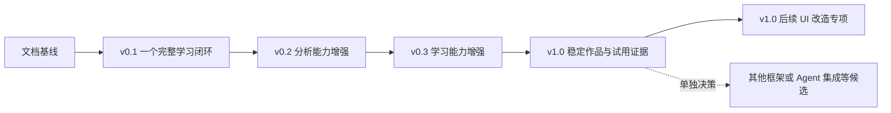

# 项目解读实验室：总体路线图

| 项目 | 内容 |
| --- | --- |
| 文档版本 | v0.26 |
| 文档状态 | v0.1–v0.3 已实现；v1.0 工程开发、参考环境验收与试用材料已完成，真实试用待进行；证据和限制见各阶段计划 |
| 更新日期 | 2026-10-02 |
| 适用阶段 | 文档准备、v0.1 至 v1.0 及候选扩展 |
| 本文职责 | 版本边界、演进顺序和阶段进入条件的权威来源 |

## 1. 路线原则

以[产品需求](requirements.md)中的学习目标为依据，先完成一个可验证的功能闭环，再扩大分析范围和教学能力。采用里程碑，不承诺未经容量评估的日期。

每个阶段同时交付产品能力、测试证据和作者学习产出。后续阶段开始前复核前一阶段结果，更新需求与对应开发计划；[首阶段计划](phase-1-plan.md)维护 M1–M5，[第二阶段计划](phase-2-plan.md)维护 M6–M10，[第三阶段计划](phase-3-plan.md)维护 M11–M15，[第四阶段计划](phase-4-plan.md)维护 M16–M20 及 UI 专项 M21，不重复维护同一任务状态。列入路线图不等于已获准开始实施。

## 2. 总路线

| 阶段 | 状态 | 主要交付 | 退出条件 |
| --- | --- | --- | --- |
| 文档基线 | 已建立；不代表运行验证完成 | 项目文档、项目指令、需求编号、任务与验收追踪 | 关键规则一致，技术假设有验证任务，运行未验证部分明确 |
| v0.1 | 标准样例与参考环境范围内本地验收完成；导入、静态分析/关联、源码、讲解、练习和固定实验已有实现；独立人工内容审阅与当前策略 DeepSeek/deepseek-flash 基础非流式兼容通过；模型仅三项配置、无应用预算/请求总期限；具体证据和限制仅见首阶段计划 | 一个 DRF + React 功能流程、源码证据、讲解、三类固定练习、请求校验实验 | 标准样例闭环可复现，首版验收用例有真实记录 |
| v0.2 | 已实现并完成参考环境验收；证据及限制见第二阶段计划 | 同栈规则扩展、候选确认/排除/撤销、文件与接口对比、静态候选影响 | AT-26 至 AT-37 有实际记录，有限规则集错误关联可核对，旧规则和历史兼容 |
| v0.3 | 已实现；验收与限制见第三阶段计划 | 知识先修图、学习路径、复习记录、网络与进程实验 | 先修关系可验证，新增实验有真实观测与失败处理 |
| v1.0 | 工程开发、参考环境验收与试用材料已完成；真人试用待后续 | 异常恢复、质量与资源评估、完整演示与试用材料 | 工程可复现且边界可信；真实试用及其关键问题结论独立验收 |
| v1.0 后续 UI 专项 | 已实现；专项验证和限制仅见第四阶段计划 M21 | 参考图多面板工作台、浅色/深色主题、手动固定双源码、真实数据联动 | 双主题与六档窗口可用，旧链接和业务保护兼容，实际回归和截图可核对 |
| 后续候选 | 未承诺 | 其他框架、Agent 变更解释、编辑器集成或多人部署 | 用户需求得到验证，另有范围、安全与成本方案 |

## 3. v0.1：一个完整学习闭环

覆盖 FR-01 至 FR-08，详细顺序见[首阶段开发计划](phase-1-plan.md)。核心是任务管理示例的“创建任务”，不要求任意导入项目都具备定制练习。

学习重点：Python 文件与 AST 处理、DRF 边界校验、React 状态与异步请求、Docker 运行边界、HTTP 请求过程、后台进程生命周期，以及依赖图 BFS/DFS 和环处理。

退出时应能够：

- 根据代码展示前后端关联并说明识别盲区。
- 在拒绝模型外发、模型失败或部分解析时保留可用能力。
- 先作预测，再看到内置实验的真实响应和写入结果。
- 演示任务失败、重试和刷新恢复，而不仅演示成功路径。

## 4. v0.2：分析能力增强

目标是帮助用户判断关系是否可信、两次源码导入之间发生了什么变化，以及哪些接口和前端入口可能受影响。实现和参考环境验收已完成，任务及实际证据只见[第二阶段计划](phase-2-plan.md)。M4-T01 真实模型兼容和 M4-T03 独立人工内容审阅的前置结论保留在首阶段计划；本版不追加模型调用。恢复时先核对已有工作，不重复实现或扩展到后续版本。

### 4.1 产品能力

- 首批规则为标准 Router 的字面量 `@action` 和常量模板 URL；以可复现失败样例为依据，保留支持清单与反例，不扩大到参数化封装或环境配置求值。
- 只确认、排除或撤销当前分析已有候选，保存人工来源和历史；不补边、不跨分析自动迁移、不进入模型上下文。
- 比较同项目的两个显式快照，展示文件行差异、接口和可唯一对应的关系变化，以及旧证据对新快照的适用性。重命名/移动按增删处理，旧引用仍属于原快照。
- 从节点或两侧变更位置反向遍历候选影响，展示路径、人工修订、未决候选及截断；不宣称精确运行图或“未找到即无影响”。

### 4.2 验证与学习

建立分离的开发样例与评估样例，人工标注真实关系，分别报告识别比例、错误关联和不支持项；先记录基线，再提出有证据的改进目标，不预设虚构准确率。

复习静态求值、评估分母、追加历史、并发修订、跨版本身份、图遍历和证据适用性。v0.2 不引入增量缓存；以后只有重复全量处理成为可测问题且另行确认范围时再评估。

## 5. v0.3：学习能力增强

本版实现、任务与验收记录只见[第三阶段计划](phase-3-plan.md)。当前另有 v1.0 开发授权，不重新维护或覆盖本版历史。

### 5.1 产品能力

- 人工维护知识点及其先修关系，形成可验证的有向无环图。
- 使用拓扑排序生成当前功能所需的学习顺序；发现环时拒绝发布该先修配置。
- 学习记录支持回顾与重新练习，区分答题记录、提示使用和人工判断。
- 加入固定容器网络实验，对比容器内 `localhost` 与服务名寻址，记录实际名称解析和连接结果。
- 加入固定子进程实验，观察 PID、输出、超时终止和回收，限制输入及资源。

### 5.2 验证与学习

代码依赖图允许有环，知识先修图不允许有环，两类图分别建模与测试。学习路径不能只是按模型随意生成的顺序排列。

新增实验沿用受控示例边界，必须验证不可用、超时、重复运行和清理失败，不开放任意项目执行。学习重点为拓扑排序、DNS/TCP、命名空间、进程与资源限制。

## 6. v1.0：稳定个人作品

当前用户明确授权规划和开发，并补充“暂无，先完成开发并准备试用材料”。开发、工程验证及后续真实试用的状态只见[第四阶段计划](phase-4-plan.md)，可复现作品说明见[v1.0 演示](v1-demo.md)，人工试用流程见[试用协议](v1-trial.md)。本轮不发送邀请、不追加真实模型调用、不更新既有实例、不进入后续候选。

沿用已有能力，增加页面渲染异常恢复、统一隔离演示入口与确定性合成规模评估。关闭模型的工程回归不替代真人试用，也不作实际模型费用或教育效果结论。

### 6.1 试用与质量

- 邀请少量符合目标画像的用户在受控示例或获授权的无敏感项目上试用。
- 使用不同但难度相近的任务观察用户能否定位代码、预测错误及解释过程；样本有限时报告个体观察，不作普遍教育效果结论。
- 记录用户需要求助的位置、错误理解、交互障碍和未覆盖写法，修复影响核心体验的问题。
- 在标注硬件、源码规模与模型配置的条件下报告耗时、峰值资源和可获得的用量；价格与计费以具体服务为准，不把 Token 数直接当作确定费用。

### 6.2 求职作品交付

形成可复现演示、架构说明、关键算法解释、失败案例复盘和真实测试记录。每项技术取舍说明解决了什么问题、有哪些限制，不以组件数量作为技术深度证明。

### 6.3 v1.0 后续 UI 改造专项

2026-10-01 用户授权实施参考图工作台改造。首次默认深色，提供浅色/深色切换并保存本机偏好；后续按用户要求拆为 11 个独立功能页，工作台保留准备摘要与入口，源码页负责文件树和手动固定的双源码窗口，API、关系、影响、知识、练习各自承担专属功能。宽窗口同时阅读双源码，窄窗口切换面板或使用抽屉。

源码保持快照归属校验和每段 200 行读取；图内展示关系与依据，保留候选、人工决定和截断，API 页保留诊断；模型继续完整预览、单次确认且不自动重试。主题和导航不触发写入，环境只展示显式基础检查结果及时间，不假装实时监控。初始 M21 只连接已有业务；用户后续明确授权服务端快照命名、增量迁移与 API-57，名称不改变源码身份。该追加范围见[浏览器注释调整](phase-4-plan.md#browser-comments)，没有增加依赖、任意项目运行、Docker 控制或作品导出。

范围、任务和验收唯一归属[第四阶段计划](phase-4-plan.md#ui-redesign)的 M21-T01 至 M21-T05。退出条件是两种主题、双窗口和旧 URL 的行为测试、前端质量/构建/类型契约检查、独立环境及六档真实浏览器验证完成。既有 M16–M20 工程记录保留；UI 回归不替代待进行的真人试用，不自动进入后续候选。

### 6.4 用户视角审阅与迭代

2026-10-02 用户授权先建立本地 Git 仓库、将既有项目分批提交，再自主审阅功能、视觉和交互。以现有 11 个模块和教学示例为范围，按“发现问题 → 最小改进 → 行为测试与浏览器复核 → 文档同步与本地提交”迭代。M22 的任务、实测和恢复入口唯一见[第四阶段计划](phase-4-plan.md#user-review)。不包含远程推送、发布、真实模型调用、任意源码执行或新增框架。

本轮优先级为导入前校验及明确反馈、首次使用的下一步引导、导航与键盘可用性；视觉调整沿用当前配色、独立模块和单实例表单。接口/数据行为变化须有具体问题与兼容验证，不能为视觉效果虚构数据。后续迭代优先依据真实试用中的卡点，而非提前扩展下表能力。工程审阅仍不能替代真实用户试用。

后续顺序：先在真实试用中观察“导入 → 根路由选择 → 第一条接口”的完成情况；再依据卡点决定是否改进根路由候选提示或任务等待反馈。原构建包大小警告只有在加载测量表明确有瓶颈时才进入拆包优化；本轮不顺带变更打包配置。试用结果、候选依据和启动决定仍在所属阶段记录。

### 6.5 页面分页与系统模块拆分

2026-10-02 用户追加要求审阅所有页面，超出可视区域的内容通过分页访问，并把系统状态、任务历史拆为两个模块。M23 围绕现有业务实现 12 个模块的可视区域分页、草稿保留、长源码与详情可达、窄屏和较矮窗口复核；系统检查沿用原 API，历史批次导航保留项目上下文和旧链接。具体任务、验证结果与限制唯一见[第四阶段计划](phase-4-plan.md#viewport-pagination)。

本次没有新增解析能力、实验种类、模型调用方式或依赖。布局验收继续与真人试用区分；原 11 模块生成预览只保留为历史设计资料。完成本次明确要求后，后续候选仍按第 7 节决定。

## 7. 后续候选及决策门槛

| 候选方向 | 启动前必须回答的问题 |
| --- | --- |
| 其他语言或框架 | 目标用户是否实际需要；能否维护独立解析规则、样例和覆盖说明 |
| Agent 变更解释 | 如何绑定前后快照、来源和用户确认；如何避免错误归因 |
| 编辑器集成 | 哪些工作流确实需要编辑器入口；如何维护权限及版本兼容 |
| 多用户或公网部署 | 身份、授权、数据隔离、删除策略、密钥管理、成本和运维是否具备独立方案 |
| 更复杂运行实验 | 是否仍为受控代码；超出边界时是否需要新的执行隔离架构 |

候选内容不是 v0.1 的隐含架构要求。不能以未来可能扩展为理由提前引入微服务、插件系统或通用执行平台。

## 8. 范围调整与长期记录

新增能力按[结构文档](project-structure.md#feature-placement)选择现有模块或必要新目录，并同步 [API 清单](api-catalog.md)。产品版本、文档版本与 HTTP API 版本分别管理；文档版本不表示产品 v0.2 已启动，不创建按产品版本分叉的工程目录。

阶段变化先修改本文的边界，再同步需求、相关规范与阶段计划。稳定需求编号不重复使用，旧验收记录保留当时的版本及条件。

若技术验证失败，优先缩小解析支持范围、明确限制或调整阶段顺序；不能通过静默取消安全要求、跳过验收或模拟实验结果来维持进度。

## 9. 修订记录

| 版本 | 日期 | 变更 | 实现状态 |
| --- | --- | --- | --- |
| v0.1 | 2026-09-28 | 建立文档阶段、四个产品版本与候选扩展的交付边界和退出条件 | 后续版本均未开始 |
| v0.2 | 2026-09-28 | 关联目录扩展与 API 清单，区分文档、产品和 HTTP API 版本 | 仅文档更新，产品任务未开始 |
| v0.3 | 2026-09-28 | 同步基础工具阶段，具体任务进度仍由阶段计划唯一维护 | 未扩大 v0.1 范围 |
| v0.4 | 2026-09-29 | 同步基础任务工程边界，固定检查不替代教学示例 | 未扩大 v0.1 范围；后续任务保持原顺序 |
| v0.5 | 2026-09-29 | 同步独立任务示例与预期关系基准 | v0.1 边界不变，未启动解析/练习/实验任务 |
| v0.6 | 2026-09-29 | 同步导入与快照边界 | 未启动后续解析、工作区或 v0.2 能力 |
| v0.7 | 2026-09-29 | 同步后端静态分析范围 | 未启动关系图、前端解析或 v0.2 能力 |
| v0.8 | 2026-09-29 | 同步静态关系图存储、遍历及 API 范围 | 未启动 M2-T04、前端工作区或 v0.2 影响分析 |
| v0.9 | 2026-09-29 | 同步三类任务重试与故障恢复边界 | 未启动 M3、学习、模型或实验任务 |
| v0.10 | 2026-09-29 | 同步 M3 前后端静态关联和工作区范围 | 未启动 M4/M5 或路线图候选功能 |
| v0.11 | 2026-09-29 | 同步 M4 本地能力及真实模型未验收边界 | 验证见阶段计划，未推进 M5 |
| v0.12 | 2026-09-29 | 同步 M5 本地交付边界，保留 M4 未验收项 | 验证见阶段计划；不宣布 v0.1 完成，不启动后续版本 |
| v0.13 | 2026-09-30 | 固定 v0.2 四项能力、非目标、进入门槛和独立阶段入口 | 规划落地，M6–M10 未开始 |
| v0.14 | 2026-09-30 | 同步独立人工内容审阅通过，保留真实模型预算缺陷 | v0.1仍受阻，未启动后续版本 |
| v0.15 | 2026-09-30 | 同步输出预算本地修复和真实兼容复验边界 | v0.1仍待验收，未启动后续版本 |
| v0.16 | 2026-09-30 | 同步一次授权真实预算复验截断失败及兼容阻塞 | v0.1未完成，M4-T03通过结论保留，未启动后续版本 |
| v0.17 | 2026-09-30 | 按用户要求取消模型应用预算/请求期限，保留独立内容审阅及旧实测记录 | 新策略真实兼容待验收，未推进后续版本 |
| v0.18 | 2026-09-30 | 同步当前策略真实兼容、v0.1本地验收及v0.2进入条件 | 门槛已满足；M6–M10未开始，具体证据仅见首阶段计划 |
| v0.19 | 2026-09-30 | 完成 v0.2 规划现状核对，移除与已有规则产物冲突的现状描述 | 任务与验收仅由第二阶段计划维护，本轮不继续开发或测试 |
| v0.20 | 2026-10-01 | 同步全版开发授权，保留范围及按版本状态归属 | 实现与验收只见第二阶段计划，不自动推进 v0.3 |
| v0.21 | 2026-10-01 | 同步 v0.2 四项能力交付及参考环境验收范围 | 任务、证据和限制只见第二阶段计划，不自动推进 v0.3 |
| v0.22 | 2026-10-01 | 同步 v0.3 学习路径、复习和固定系统实验职责及边界 | 实际状态、证据与限制仅见第三阶段计划 |
| v0.23 | 2026-10-01 | 落实 v1.0 开发授权、工程与真人试用分别验收及第四阶段入口 | 实际状态、证据和限制仅见第四阶段计划 |
| v0.24 | 2026-10-01 | 记录用户授权的 UI 专项、双主题/双源码及退出条件 | 已实现；M21 唯一任务及验证来源为第四阶段计划 |
| v0.25 | 2026-10-02 | 同步本地 Git、用户视角迭代及后续验证优先级，校正 M21 当前模块与命名范围 | M22 唯一任务及验证来源为第四阶段计划；真实试用状态保留 |
| v0.26 | 2026-10-02 | 增加用户追加的 M23 分页与系统职责拆分范围，保留候选和真实试用门槛 | 验证唯一见第四阶段计划 |
