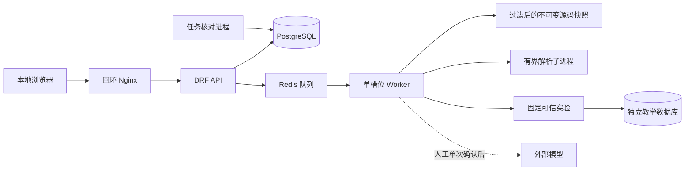

# v1.0 演示与作品说明

当前M26已将产品收敛为项目管理、源码工作区和操作日志。课程、练习、实验、对比、候选影响及人工校准属于历史范围，旧演示步骤不作为当前使用指南；当前流程见[README](../README.md)，实际验收唯一见[第四阶段计划M26](phase-4-plan.md#m26)。

本文件负责可复现演示、架构与算法说明、失败复盘和适用范围；任务与真实测试结果只在[第四阶段计划](phase-4-plan.md)维护。v1.0 开发交付与真实用户试用分别验收，未执行试用不能宣称教育效果。

## 1. 环境与启动

参考环境为 Windows x64 + Docker Desktop Linux amd64，Python 3.13.15、Node 24.21.0；精确依赖沿用各工程现有锁文件。新宿主先按 [README 工具与启动](../README.md#启动与访问)准备 Docker 和固定工具。本轮不宣称全新宿主下载过程或 ARM 已验证。

以下命令在 `F:\Program\Fall_Campus_Recruitment` 执行，使用项目既有隔离 Python；Docker 不在 PATH 时显式指定完整路径。入口不读取根 `.env`，模型保持关闭。

```powershell
& '.runtime/m1-t02-venv/Scripts/python.exe' -B -X utf8 scripts/check_v1_release.py start --build --docker 'C:/Program Files/Docker/Docker/resources/bin/docker.exe'
& '.runtime/m1-t02-venv/Scripts/python.exe' -B -X utf8 scripts/check_v1_release.py check --docker 'C:/Program Files/Docker/Docker/resources/bin/docker.exe'
```

第一条按原锁文件构建三个本地镜像并启动独立项目；已有镜像可省略 `--build`，不存在时明确失败，不自动拉取。入口为 [5181 工作区](http://127.0.0.1:5181/)，内部数据库、Redis 和教学实验不发布宿主端口。端口冲突或已有未关闭状态时拒绝启动，不换端口或接管现有资源。

第二条复用既有 v0.1 请求实验、v0.2 候选/对比/影响和 v0.3 路径/复习/系统实验检查。知识卡片按当前发布内容清单核对，三类练习验证正确性与同键重放；请求实验复用 M5 的 `--labs-only`，避免旧 M4 五张卡片假设。随后运行 9/100/500 文件各三次导入/分析。均为无敏感标准或合成数据；不调用模型。报告在 `.runtime/v1-verify/report.json`，HTTP 记录在同目录，v0.3 记录的 `workspace_url` 可直接用于下述演示。不要把生成的练习反馈当作真实用户答案。

关闭本次演示环境，默认保留其测试卷：

```powershell
& '.runtime/m1-t02-venv/Scripts/python.exe' -B -X utf8 scripts/check_v1_release.py stop --docker 'C:/Program Files/Docker/Docker/resources/bin/docker.exe'
```

如确定这些是可删除的本次测试数据，给 `stop` 追加 `--remove-test-data`。这会删除标签归属已核对的本次测试卷，无法恢复其中历史；脚本不会操作其他项目。清理失败保留状态且返回非零，不宣称成功。状态、报告和旧状态归档位于忽略的 `.runtime/v1-verify`，不是新的项目记忆系统。不要手动修改状态来接管别人的项目。

## 2. 十分钟演示顺序

1. 打开标准样例的创建任务工作区。选 `POST /api/v1/tasks/`，沿 React 提交、请求、DRF、序列化器、模型的静态证据读源码；说明框架分派与实际运行的区别。
2. 打开候选关系，查看确认/排除/撤销历史。选择两个显式快照的对比，展示两侧源码、旧证据适用性和候选影响；说明未知候选和遍历截断的含义。
3. 进入练习，查看先修顺序。先作答、使用提示，再追加自评并重新练习；原提示标记和答案不被自评或新答案覆盖。
4. 先填写请求校验预测，再提交固定实验；核对 201/400/400/400、写入 1/0/0/0、实际响应及清理。错误预测也保留。
5. 运行固定网络与进程实验。对比 Worker 的 localhost 与服务名连接，核对真实 PID、输出、超时 -9 和 wait 回收。预测不同于观测不表示实验失败。
6. 刷新、键盘切换、打开原源码引用及任务历史，核对归属。演示可见失败记录与显式重试的区别，避免自动再提交未知结果。
7. 讲解是可选环节：本入口关闭模型；说明预览、单次确认、引用校验和原讲解历史。真实调用须按既有流程人工审阅并单次确认，替身或静态说明不能当作真实模型验收。

标准样例的完整主线需实际 HTTP、Worker、PostgreSQL 和受控实验成功。HTTP 200、镜像构建或图截图各自不能替代整个闭环。

## 3. 架构与信任边界



- API 校验来源、CSRF、输入和归属，长任务交给 Worker。结果与任务成功状态原子发布；任务资格失效后拒绝迟到写入。
- `projects` 独占归档过滤、快照和受控文件读取；`analysis` 拥有静态图、候选修订、双侧对比和影响；`jobs` 拥有任务协议，不承载所有业务结果。
- `learning` 保存版本化内容与追加作答/自评；`labs` 只调用固定可信程序；`explanations` 保存预览、单次确认、受校验讲解和原引用。
- 前端依赖方向为 app → features → shared。URL 恢复工作区归属，查询键隔离读取，幂等键恢复未知写入；不因刷新或渲染恢复自动产生新的写任务。

导入项目只读，不安装依赖、不执行 Python/JS 或 Docker 配置。固定实验的结果只证明受控样例行为。单用户回环、CSRF 和内部网络不能替代多用户认证或通用代码沙箱。

## 4. 可以解释的算法与取舍

| 问题 | 实现与取舍 | 限制 |
| --- | --- | --- |
| 源码关系 | AST/TypeScript 语法树与有限静态字符串求值，方法/路径唯一匹配，动态写法保留候选/诊断 | 不恢复所有运行路径；真实正确率仅适用于有限样例及其分母 |
| 图浏览与影响 | BFS/DFS 与反向邻接遍历，visited 防环，预算截断可见；邻接遍历 O(V+E)，预算限制可读结果 | 图路径是候选影响，空结果不证明无影响 |
| 快照对比 | 文件摘要、行差异、可唯一对应的语义身份和原证据适用性分别计算 | 重命名按增删；旧引用永远属于原快照 |
| 学习路径 | 目标先修闭包、全图环检查与确定性堆拓扑排序；闭包 O(V+E)，堆排序 O((V+E) log V) | 人工课程覆盖有限；代码依赖允许环，知识先修不允许环 |
| 历史与恢复 | 追加记录、事务唯一约束、幂等请求、领取资格及迟到拒绝 | 不是跨外部系统的分布式事务；未知计费请求不自动重发 |
| 页面异常 | 应用错误边界显示通用恢复提示，原地址重载；只记录固定诊断码 | 不捕获任意事件、异步异常或 JS 入口下载失败 |

错误边界按 [React 官方组件文档](https://react.dev/reference/react/Component#catching-rendering-errors-with-an-error-boundary)实现，无新依赖。资源测量使用 cgroup 内核峰值；[Docker stats 文档](https://docs.docker.com/reference/cli/docker/container/stats/)说明 CLI 内存读数的缓存口径，因此不把一次 stats 读数冒称峰值。

## 5. 失败案例与复盘

| 可观察失败 | 应对与取舍 | 核对方式 |
| --- | --- | --- |
| 动态路由或不唯一关系 | 留诊断/候选，不编造连接；人工决定只绑定原分析 | 看来源、规则版本和人工历史 |
| 模型截断/非法引用 | 拒绝发布，不自动重发；取消应用预算不取消内容校验 | 历史失败及单次确认见首阶段计划 |
| 网络服务不可用 | 保留真实失败、部分观测与清理状态；恢复后显式新尝试 | 实验历史与原/新任务分别读取 |
| Worker 失效 | 领取核对使任务收敛，终态拒绝旧 Worker 写入 | 独立故障测试；不停止日常 Worker |
| 渲染异常 | 页面提供重新加载及任务入口，不回显原始错误 | 新组件测试；异步 API 错误仍由现有反馈处理 |
| 沙箱 EPERM/WinError 5 | 在许可上下文运行必要验证，保留原测试要求 | 区分环境阻塞和实现失败，不弱化断言 |
| Compose 构建镜像继承项目标签 | 显式 Docker 构建，归属还需实际 Compose 容器标签；拒绝清理身份不明资源 | 镜像标签负向测试与独立实际启动/清理 |
| 旧验收假设卡片数量固定为五张 | 依据当前发布清单严格核对，不修改历史验收或放宽断言 | 当前卡片、题目及模型关闭的真实 HTTP 检查 |

## 6. 资源报告如何阅读

报告保留每次完整 HTTP 耗时、最小/中位/最大值、文件/字节/行规模、覆盖和截断。单次耗时包含排队、真实执行、结果读取及 0.2 秒轮询误差。三个暖缓存串行样本不足以给出 p95、并发容量或 SLA。

内存峰值为容器从创建至读取的 cgroup 最大值，包含迁移之后的服务启动及全部验收；不是某一次解析的增量内存。cgroup v2 不可读时尝试 v1，两者均不可读时为 `null` 且 `unavailable=true`。CPU/PID/内存配置和真实用量分别记录。Docker 的可用内存和宿主物理内存不同，不能混用。

本入口模型关闭，调用数为 0，用量和费用为 `null`；这不是实际模型单次价格评估。原真实兼容与用量见首阶段计划，收费与账单由供应商决定。真实用户试用按[试用协议](v1-trial.md)进行，尚未试用时不填造参与者或学习效果。
