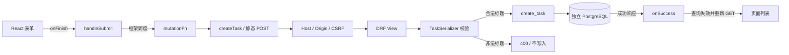

# 任务簿：独立教学示例

示例版本 `task-board/1.0.0`。React 提交标题，DRF 校验并写入独立 PostgreSQL，成功后重新获取列表。默认配置仅提供任务创建和查询；M5 专用配置增加固定内部实验资源，仍不运行任意项目。

## 启动

从项目根目录 `F:\Program\Fall_Campus_Recruitment` 执行：

```powershell
$env:PATH = 'C:/Program Files/Docker/Docker/resources/bin;' + $env:PATH
docker compose up -d --build --wait --wait-timeout 90 task-board-frontend
```

访问 [任务簿](http://127.0.0.1:5174/)。显式指定示例服务只启动其独立依赖，不要求工作台 API、Redis 或 Worker 运行。根 Compose 中示例使用 `task-board` profile，普通工作台启动不自动启动它。仅前端入口发布回环端口；API、数据库和凭据卷不发布宿主端口。凭据在示例私有卷内生成，不需要创建环境文件。命名卷保留任务和幂等键，停止服务不会删除数据。

仅停止本示例：

```powershell
docker compose stop task-board-frontend task-board-api task-board-postgres
```

首次构建需连接官方依赖源。参考环境为 Windows x64 宿主、Linux amd64 容器；未验证公网、多用户或 ARM。端口被占用时启动失败，不自动切换。

## 行为与数据流

标题必须为字符串，去除首尾空白后 1–200 个字符。缺失、null、非字符串、空白、NUL、超长及未知字段返回 400，不写入。不同操作可创建同名标题；相同操作键与规范化标题重放返回 200 和原资源，标题冲突返回 409。成功创建为 201，资源仅含 `id`、`title`、`created_at`；列表使用公共分页和稳定倒序。



上图是教学流程，回调与 HTTP 连接包含框架推导，不是逐函数运行轨迹。HTTP 校验提供字段反馈；数据库非空白约束和唯一键在绕过 Serializer 或并发写入时仍保护数据。ORM 保存不会自动运行全部 HTTP 校验，不能混淆两者职责。

匿名写入仍要求精确同源与 Django CSRF。Cookie 使用独立名称 `task_board_csrftoken`，因为 Cookie 不按端口隔离。写请求不自动重发；浏览器仅在会话中保存随机操作键，不保存标题。结果未知时原页面保留原标题，刷新后需重填原标题恢复；校验失败或冲突仍保留恢复键。成功后重新查询，列表读取失败会明确区分“已创建”与“列表未刷新”。

## 源码和预期关系

- 页面：[TaskBoard.tsx](frontend/src/features/tasks/TaskBoard.tsx)，静态请求：[tasks-api.ts](frontend/src/features/tasks/api/tasks-api.ts)。
- 路由：[总路由](backend/config/urls.py)、[模块路由](backend/apps/tasks/api/urls.py)。
- 后端：[视图](backend/apps/tasks/api/views.py)、[序列化器](backend/apps/tasks/api/serializers.py)、[服务](backend/apps/tasks/services.py)、[模型](backend/apps/tasks/models.py)。
- [人工关系基准](../../testdata/analysis/task-board-create.json)绑定版本、相对路径、行号、锚点与文件 SHA-256。由编码代理逐项维护并核对，尚不代表用户独立审阅。源码修改后须重新审阅关系，不可仅机械更新摘要。

基准不伪造 `snapshot_id`，后续导入后才映射真实不可变快照。框架推导单独标注规则及版本；预期输入和响应类别与真实观测分开。当前准备 AT-04 的 path/include/as_view 子集、AT-07 的 fetch/本地调用子集及 AT-16 输入基准；工作台解析、练习与实验的实际进度见阶段计划；这里不据人工基准宣称这些功能已验收。

## 验证入口

根目录，示例运行后：

```powershell
docker compose run --rm --no-deps task-board-api python -m pytest -q -p no:cacheprovider
docker compose exec -T task-board-api python manage.py check
python -X utf8 scripts/check_task_board.py --restart
python -X utf8 scripts/check_task_board_annotations.py
python -X utf8 -m unittest discover -s scripts -p test_check_task_board_annotations.py -v
```

`--restart` 短暂重启**示例** API 和数据库；不影响工作台，不删除卷。HTTP 检查新增一条无敏感内容的测试任务并保留，比较每次请求的真实写入差值；并发期间请勿手动新增示例任务，否则差值验收会失败。报告位于被忽略的 `.runtime/m1-t03-http-verification.json`，只保存自建输入和实际响应，不保存令牌。数据库测试使用 Django 临时测试数据库；依赖故障测试中的注入仅用于可重复错误路径，不能冒充真实故障演练。

在 `examples/task-board/backend` 使用已锁定 Python 环境执行：

```text
python -m ruff check .
python -m ruff format --check .
python -m mypy config common apps --no-incremental
python manage.py makemigrations --check --dry-run --settings config.settings.test
python manage.py spectacular --settings config.settings.test --file ../contracts/openapi.yaml --validate --fail-on-warn
```

在 `examples/task-board/frontend` 使用 Node 24.21.0/npm 11.19.0 执行：

```text
npm ci
npm run api:types
npm run api:types:check
npm run typecheck
npm run lint
npm run format:check
npm run test -- --run
npm run test:tooling
npm run build
```

两端拥有独立清单和锁文件，版本沿用工作台基线，不在运行时导入工作台模块。示例无队列依赖；前端保留同版 Ant Design 声明补丁与回归测试。Schema 和生成声明只覆盖三个示例操作，不能手改生成类型。根目录 `scripts/check_contracts.py` 同时核对公开契约和下述实验专用契约，命令见[根 README](../../README.md)。示例未知路径和方法错误使用统一对象；客户端保留合法机器码及请求标识。人工标注修订为 `annotation_version=1.0.1`，只同步契约配置变动后的原引用，教学示例仍为 `task-board/1.0.0`。完整执行记录及限制仅维护在[阶段计划](../../docs/phase-1-plan.md)，不在此另记任务进度。

## 固定实验专用配置

`config.settings.labs` 加载 `apps/labs` 和内部 `/internal/labs/runs/{run_id}/` 资源，实验版本为 `task-board/1.0.0+request-validation/1`。四种固定输入复用原校验和写入服务，原九个教学源码文件及其摘要未改变。正常输入首次返回 201，同运行同用例返回 200；缺失、空与纯空白返回真实 400。

运行身份与 case 派生固定写入键，count/close 只涉及本次运行。关闭标记保留以拒绝迟到写入；120 秒 TTL 和 `python manage.py reconcile_lab_runs --loop` 的 5 秒核对处理到期运行。核对进程不需要队列，数据库中断后恢复重试；无数据卷重置或全表清理。

独立 Schema `contracts/labs-openapi.yaml` 用 `config.settings.labs_test` 导出（原 3 操作加内部 4 操作），不改变公开前端类型。专用服务仅在 M5 独立 Compose 网络中启用，由工作台 Worker 固定访问，保留原 Host/Origin/CSRF 检查。启动与演示见根 README 的 M5 部分，不向宿主发布内部 API。
